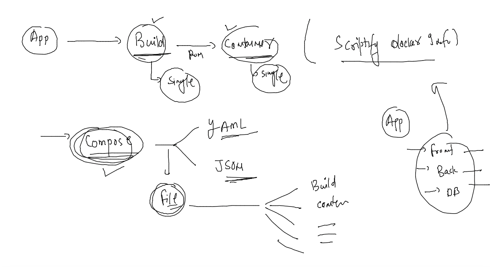
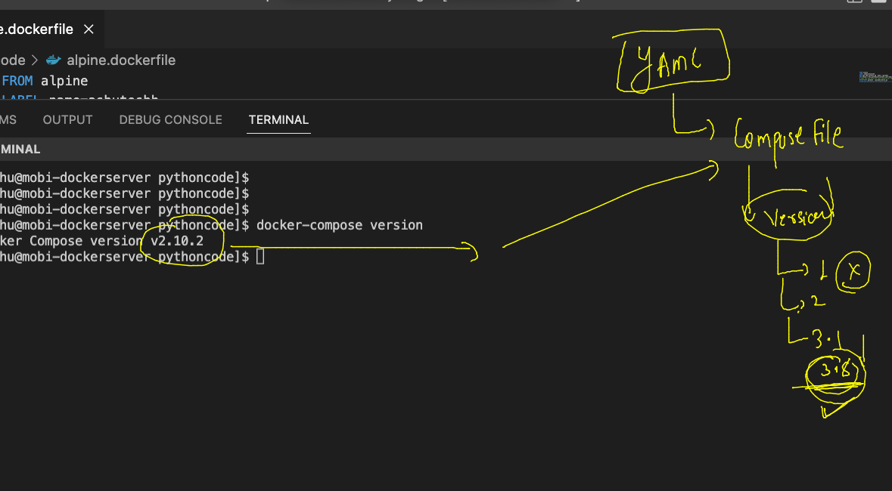
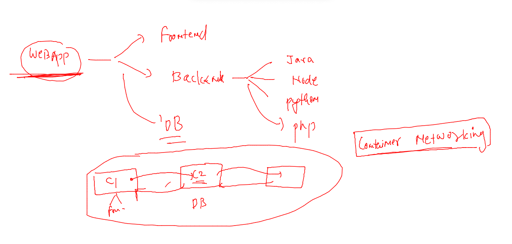
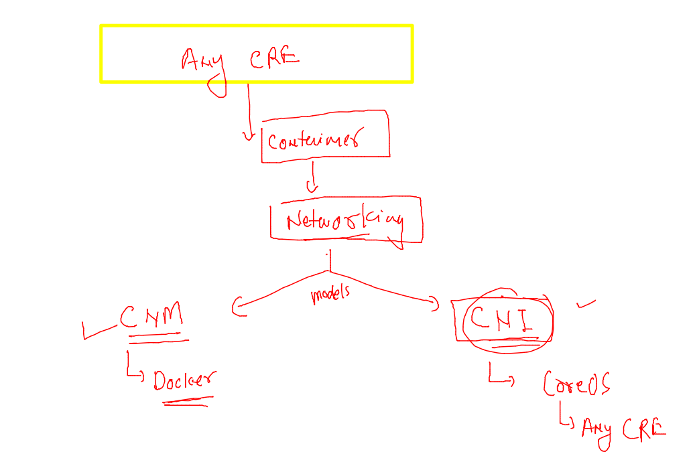
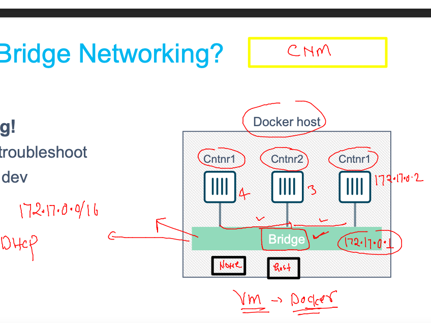
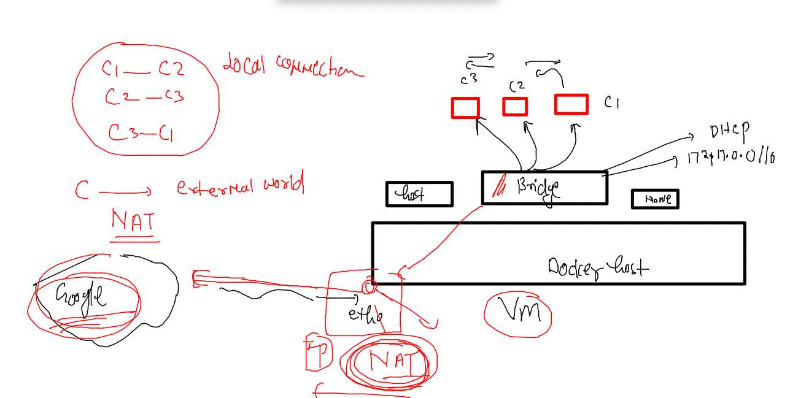
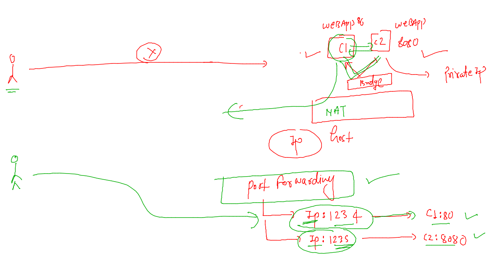
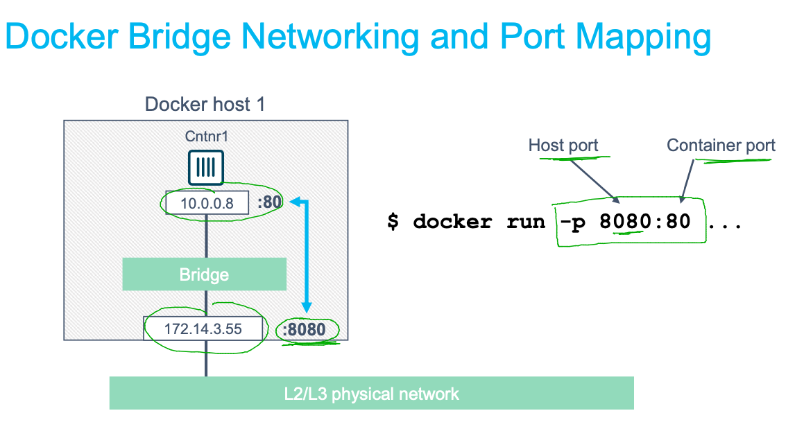

## Training plan 


## Dockerfile for java code 

### sample java code 

```
class myclass { 
    public static void main(String args[]) 
    { 
        // test expression 
        while (true) { 
            System.out.println("Hello World this is container "); 
  
            // update expression 
        } 
    } 
} 
```


### Dockerfile

```
FROM openjdk 
# calling docker image from docker hub 
LABEL email=ashutoshh@linux.com 
RUN mkdir /code 
# to get shell access during image build time 
COPY hello.java /code/
# it can only take data from the same location where Dockerfile is present 
WORKDIR /code 
# to change directory location during image build time 
RUN javac hello.java 
# compiling java code
CMD ["java","myclass"]
# to set default process in this final image 
# also known as container start up program 

```

### lets run it 

```
[ashu@mobi-dockerserver myimages]$ ls
javacode  pythoncode
[ashu@mobi-dockerserver myimages]$ ls javacode/
Dockerfile  hello.java
[ashu@mobi-dockerserver myimages]$ docker  build -t  ashujava:v1  javacode/ 
Sending build context to Docker daemon  3.072kB
Step 1/7 : FROM openjdk
 ---> 2ca167855991
Step 2/7 : LABEL email=ashutoshh@linux.com
 ---> Running in 4f5f68446b40
Removing intermediate container 4f5f68446b40
 ---> 7866b0f87200
Step 3/7 : RUN mkdir /code
 ---> Running in 813ce4bf8c44
Removing intermediate container 813ce4bf8c44
 ---> c36ff19e3a7e
Step 4/7 : COPY hello.java /code/
 ---> ddd934fb8432
Step 5/7 : WORKDIR /code
 ---> Running in d007250a4c85
Removing intermediate container d007250a4c85
 ---> f89ad63190dc
Step 6/7 : RUN javac hello.java
 ---> Running in fdc18db0df19
Removing intermediate container fdc18db0df19
 ---> abc56daef6f5
Step 7/7 : CMD ["java","myclass"]
 ---> Running in 2991f21f8fa6
Removing intermediate container 2991f21f8fa6
 ---> 91bcde702cd4
Successfully built 91bcde702cd4
Successfully tagged ashujava:v1
```


### creating container 

```
[ashu@mobi-dockerserver myimages]$ docker run -itd --name ashujc1 ashujava:v1 
71b5f68ccaaf8ecc1d2cc836ae8b6db0ac86c79377fee6b33bcd4f1549c07f7f
[ashu@mobi-dockerserver myimages]$ docker  ps
CONTAINER ID   IMAGE              COMMAND                  CREATED              STATUS              PORTS     NAMES
71b5f68ccaaf   ashujava:v1        "java myclass"           4 seconds ago        Up 2 seconds                  ashujc1
```

### checking jdk version 

```
[ashu@mobi-dockerserver myimages]$ docker  exec -it ashujc1  bash 
bash-4.4# 
bash-4.4# java -version 
openjdk version "18.0.2.1" 2022-08-18
OpenJDK Runtime Environment (build 18.0.2.1+1-1)
OpenJDK 64-Bit Server VM (build 18.0.2.1+1-1, mixed mode, sharing)
bash-4.4# exit
exit
```

### jdk11 version 

```
FROM oraclelinux:8.4 
# calling docker image from docker hub 
LABEL email=ashutoshh@linux.com 
RUN yum  install java-11-openjdk.x86_64 java-11-openjdk-devel.x86_64 -y 
RUN mkdir /code 
# to get shell access during image build time 
COPY hello.java /code/
# it can only take data from the same location where Dockerfile is present 
WORKDIR /code 
# to change directory location during image build time 
RUN javac hello.java 
# compiling java code
CMD ["java","myclass"]
# to set default process in this final image 
# also known as container start up program 
```

### rebuild it --

```
ashu@mobi-dockerserver myimages]$ docker  build -t  ashujava:jdk11 -f javacode/jdk11.dockerfile   javacode/ 
Sending build context to Docker daemon  4.608kB
Step 1/8 : FROM oraclelinux:8.4
 ---> 97e22ab49eea
Step 2/8 : LABEL email=ashutoshh@linux.com
 ---> Running in 42da582ed0a2
Removing intermediate container 42da582ed0a2
 ---> 043dedc4aaad
Step 3/8 : RUN yum  install java-11-openjdk.x86_64 java-11-openjdk-devel.x86_64 -y
 ---> Running in be57ecdde9ba
Oracle Linux 8 BaseOS Latest (x86_64)            52 MB/s |  49 MB     00:00    

```

### Solution of task 2 

```
FROM alpine
LABEL name=ashutoshh
RUN apk add python3 &&  mkdir /pycodes
ADD https://raw.githubusercontent.com/redashu/pythonLang/main/while.py /pycodes/
# COPY and add both are same keyword but add can take data from URL as well
ENTRYPOINT python3  /pycodes/while.py 
# CMD and Entrypoint are almost same 
```

## Image push & pull 


### tagging image in the format of docker hub 

```
[ashu@mobi-dockerserver pythoncode]$ docker  images  |   grep -i ashu
ashualp                      pycodev1   40c5e132bb3b   16 minutes ago      55.8MB
ashujava                     jdk11      a1906c97a8af   42 minutes ago      654MB
ashujava                     v1         91bcde702cd4   About an hour ago   462MB
ashupython                   v3         1913069ea063   19 hours ago        442MB
ashupython                   v2         31dd9bde8463   20 hours ago        921MB
ashupython                   v1         53ee4bfb3343   21 hours ago        921MB
[ashu@mobi-dockerserver pythoncode]$ 
[ashu@mobi-dockerserver pythoncode]$ docker  tag  ashupython:v3  docker.io/dockerashu/ashupyapp:checkv1  
[ashu@mobi-dockerserver pythoncode]$ 


```

### login 

```
[ashu@mobi-dockerserver pythoncode]$ docker login -u dockerashu 
Password: 
WARNING! Your password will be stored unencrypted in /home/ashu/.docker/config.json.
Configure a credential helper to remove this warning. See
https://docs.docker.com/engine/reference/commandline/login/#credentials-store

Login Succeeded
```

### pushing image to docker hub 

```
[ashu@mobi-dockerserver pythoncode]$ docker  push  docker.io/dockerashu/ashupyapp:checkv1
The push refers to repository [docker.io/dockerashu/ashupyapp]
ac6947dbfb05: Pushed 
ee514409e9e3: Pushed 
deb5b63dc9cd: Pushed 
2d3586eacb61: Mounted from pronojitroy/roy-python 
checkv1: digest: sha256:e287f85882b19ead84462c2cdef8af0836b5c234a3d547f297a51b58f4bec14d size: 1156
[ashu@mobi-dockerserver pythoncode]$ 
```

### docker logout 

```
[ashu@mobi-dockerserver pythoncode]$ docker logout 
Removing login credentials for https://index.docker.io/v1/
```

## Docker instruction Scripting 



### compose installation 

```
[root@mobi-dockerserver ~]# curl -SL https://github.com/docker/compose/releases/download/v2.10.2/docker-compose-linux-x86_64 -o /usr/bin/docker-compose 
  % Total    % Received % Xferd  Average Speed   Time    Time     Time  Current
                                 Dload  Upload   Total   Spent    Left  Speed
  0     0    0     0    0     0      0      0 --:--:-- --:--:-- --:--:--     0
100 24.5M  100 24.5M    0     0  94.9M      0 --:--:-- --:--:-- --:--:--  184M
[root@mobi-dockerserver ~]# chmod +x /usr/bin/docker-compose 
[root@mobi-dockerserver ~]# 
[root@mobi-dockerserver ~]# 


```

### checking 

```
[ashu@mobi-dockerserver pythoncode]$ docker-compose version 
Docker Compose version v2.10.2
```

### compose file version 



### Compose example 1 

```
version: '3.8' # compose file version 
services: # number of application you want to manage 
  ashuapp-frontend: 
    image: alpine
    container_name: ashuc1
    command: ping fb.com

```

### lets run it 

```
[ashu@mobi-dockerserver myimages]$ ls
ashu-compose  javacode  pythoncode
[ashu@mobi-dockerserver myimages]$ cd  ashu-compose/
[ashu@mobi-dockerserver ashu-compose]$ ls
docker-compose.yaml
[ashu@mobi-dockerserver ashu-compose]$ docker-compose up -d
[+] Running 2/2
 ⠿ Network ashu-compose_default  Created                                                         0.1s
 ⠿ Container ashuc1              Started                                                         0.6s
[ashu@mobi-dockerserver ashu-compose]$ docker-compose ps
NAME                COMMAND             SERVICE             STATUS              PORTS
ashuc1              "ping fb.com"       ashuapp-frontend    running             
[ashu@mobi-dockerserver ashu-compose]$ 

```

### more compose commands 

```
[ashu@mobi-dockerserver ashu-compose]$ docker-compose ps
NAME                COMMAND             SERVICE             STATUS              PORTS
ashuc1              "ping fb.com"       ashuapp-frontend    running             
[ashu@mobi-dockerserver ashu-compose]$ docker-compose stop 
[+] Running 1/1
 ⠿ Container ashuc1  Stopped                                                                    10.2s
[ashu@mobi-dockerserver ashu-compose]$ docker-compose ps
NAME                COMMAND             SERVICE             STATUS              PORTS
ashuc1              "ping fb.com"       ashuapp-frontend    exited (137)        
[ashu@mobi-dockerserver ashu-compose]
```

### more commands

```
[ashu@mobi-dockerserver ashu-compose]$ docker-compose ps
NAME                COMMAND             SERVICE             STATUS              PORTS
[ashu@mobi-dockerserver ashu-compose]$ docker-compose create
[+] Running 2/1
 ⠿ Network ashu-compose_default  Created                                                         0.1s
 ⠿ Container ashuc1              Created                                                         0.0s
[ashu@mobi-dockerserver ashu-compose]$ docker-compose ps
NAME                COMMAND             SERVICE             STATUS              PORTS
ashuc1              "ping fb.com"       ashuapp-frontend    created             
[ashu@mobi-dockerserver ashu-compose]$ docker-compose start
[+] Running 1/1
 ⠿ Container ashuc1  Started                                                                     0.5s
[ashu@mobi-dockerserver ashu-compose]$ docker-compose ps
NAME                COMMAND             SERVICE             STATUS              PORTS
ashuc1              "ping fb.com"       ashuapp-frontend    running             
[ashu@mobi-dockerserver ashu-compose]$ 
```

### accessing container shell using compose 

```
[ashu@mobi-dockerserver ashu-compose]$ docker-compose ps
NAME                COMMAND             SERVICE             STATUS              PORTS
ashuc1              "ping fb.com"       ashuapp-frontend    running             
[ashu@mobi-dockerserver ashu-compose]$ docker-compose exec  ashuapp-frontend  sh
/ # whoami
root
/ # ls 
bin    etc    lib    mnt    proc   run    srv    tmp    var
dev    home   media  opt    root   sbin   sys    usr
/ # exit
[ashu@mobi-dockerserver ashu-compose]$ 
```

### Delete all app containers 

```
[ashu@mobi-dockerserver ashu-compose]$ docker-compose down 
[+] Running 0/1
 ⠴ Container ashuc1  Stopping                                                                    8.6s

```

### Example 2 

```
version: '3.8' # compose file version 
services: # number of application you want to manage 
  ashu-pythonapp:
    image: ashupyimg:v1 # image i want to build
    build:  # calling image build instruction 
      context: ../pythoncode # location of Dockerfile 
      dockerfile: Dockerfile # name of dockerfile 
    container_name: ashupyc1 
    
  ashuapp-frontend: 
    image: alpine
    container_name: ashuc1
    command: ping fb.com

```

## networking in containers 



### Networking models in Containers 



### Docker bridge and containers IP address 



### checking bridges 

```
[ashu@mobi-dockerserver ashu-compose]$ docker network  ls
NETWORK ID     NAME      DRIVER    SCOPE
b301c26dcbbd   bridge    bridge    local
9877e4991da4   host      host      local
b1435c369c1d   none      null      local
[ashu@mobi-dockerserver ashu-compose]$ docker network inspect b301c26dcbbd  
[
    {
        "Name": "bridge",
        "Id": "b301c26dcbbd9131c3a0ca2083b8c961a866408dddf9dc895bcf5d06c95deaa3",
        "Created": "2022-09-13T07:20:06.993390054Z",
        "Scope": "local",
        "Driver": "bridge",
        "EnableIPv6": false,
        "IPAM": {
            "Driver": "default",
            "Options": null,
            "Config": [
                {
                    "Subnet": "172.17.0.0/16",
                    "Gateway": "172.17.0.1"
                }
            ]
        },
        "Internal": false,
        "Attachable": false,
        "Ingress": false,
        "ConfigFrom": {
            "Network": ""
        },
        "ConfigOnly": false,
        "Containers": {},
        "Options": {
```

### Containers in same bridge can connect to each other 


```
root@mobi-dockerserver ~]# docker  exec -it  ashuc1   sh 
/ # ifconfig 
eth0      Link encap:Ethernet  HWaddr 02:42:AC:11:00:02  
          inet addr:172.17.0.2  Bcast:172.17.255.255  Mask:255.255.0.0
          UP BROADCAST RUNNING MULTICAST  MTU:1500  Metric:1
          RX packets:14 errors:0 dropped:0 overruns:0 frame:0
          TX packets:0 errors:0 dropped:0 overruns:0 carrier:0
          collisions:0 txqueuelen:0 
          RX bytes:1112 (1.0 KiB)  TX bytes:0 (0.0 B)

lo        Link encap:Local Loopback  
          inet addr:127.0.0.1  Mask:255.0.0.0
          UP LOOPBACK RUNNING  MTU:65536  Metric:1
          RX packets:0 errors:0 dropped:0 overruns:0 frame:0
          TX packets:0 errors:0 dropped:0 overruns:0 carrier:0
          collisions:0 txqueuelen:1000 
          RX bytes:0 (0.0 B)  TX bytes:0 (0.0 B)

/ # ping  172.17.0.4
PING 172.17.0.4 (172.17.0.4): 56 data bytes
64 bytes from 172.17.0.4: seq=0 ttl=64 time=0.152 ms
64 bytes from 172.17.0.4: seq=1 tt
```


## Understanding NAT 



### External world can access container app using port forwarding



### port f again 




