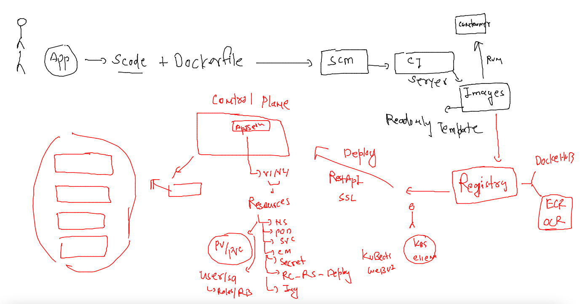
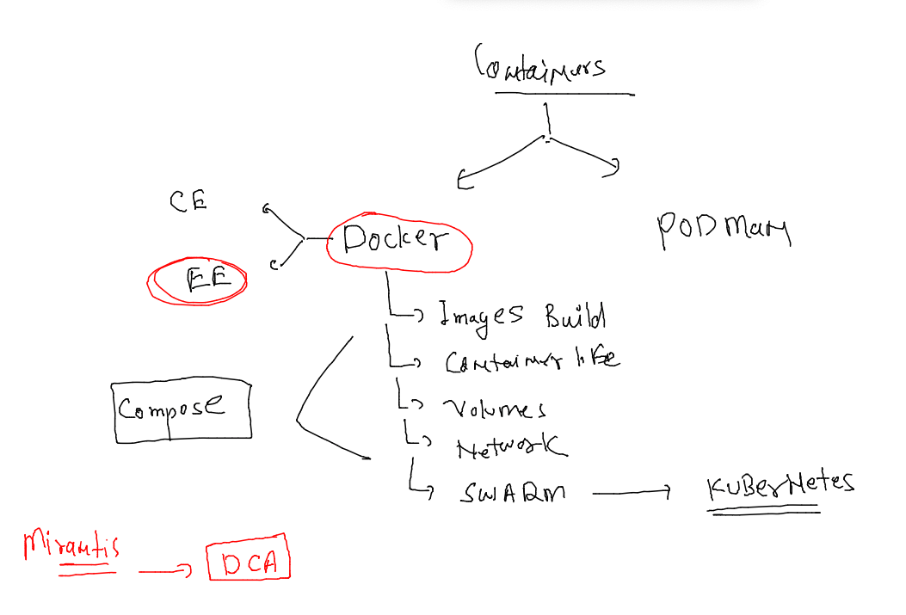
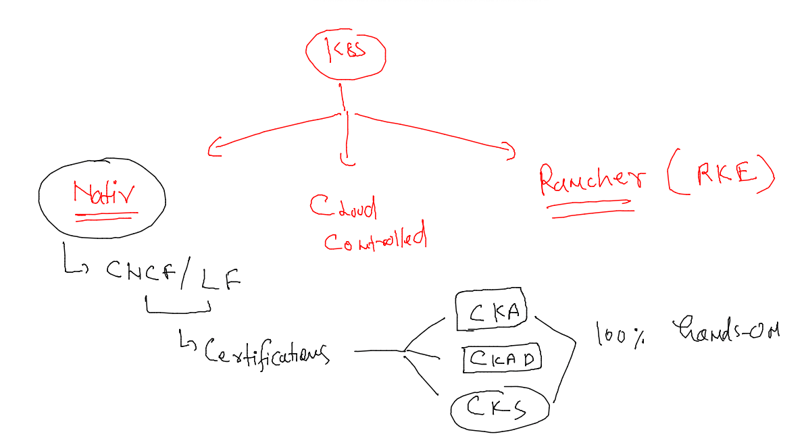
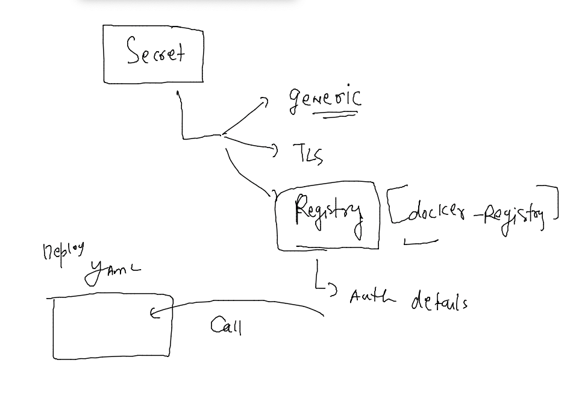
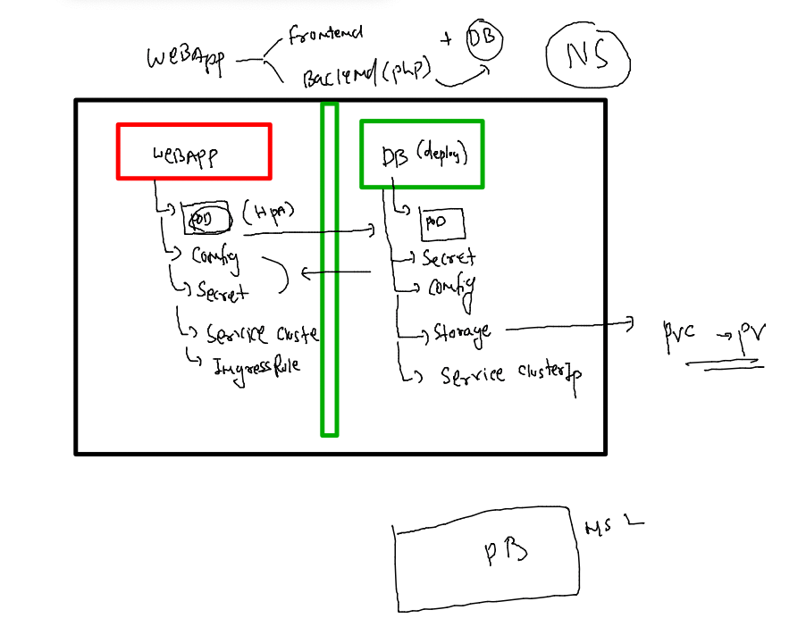
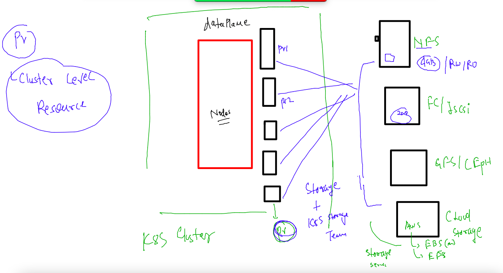
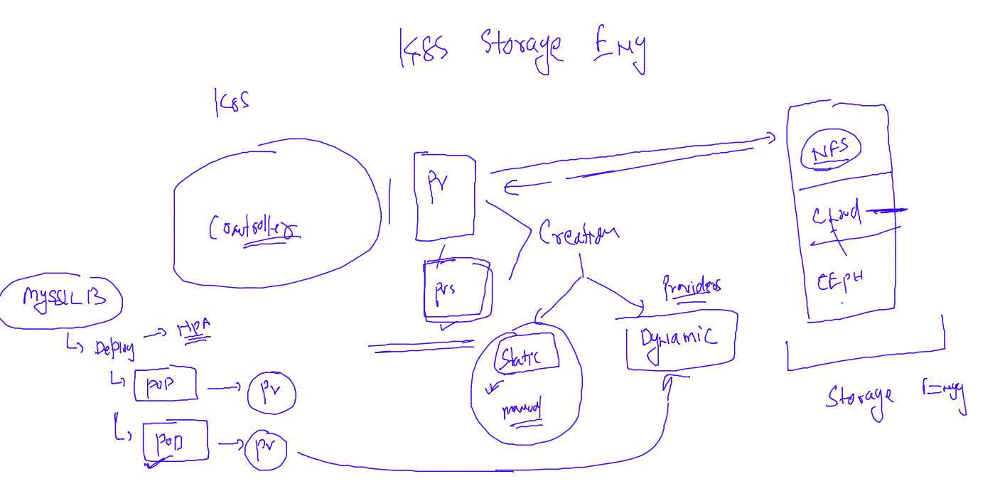
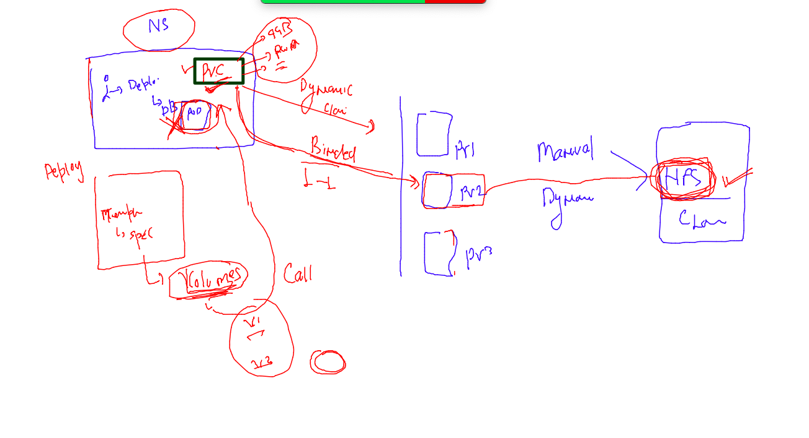

## Training plan 


### clean up namespaces  data

```
[ashu@mobi-dockerserver myimages]$ kubectl config get-contexts 
CURRENT   NAME                          CLUSTER      AUTHINFO           NAMESPACE
*         kubernetes-admin@kubernetes   kubernetes   kubernetes-admin   ashu-project
[ashu@mobi-dockerserver myimages]$ kubectl delete all --all
No resources found
[ashu@mobi-dockerserver myimages]$ 
```

### Revision 



### Docker Certification 



### kubernetes certifications 



### Deploy private container image to k8s 

### 

```
kubectl  create deployment  ashuapp --image=phx.ocir.io/axmbtg8judkl/ashuweb:mobiv1  --port 80 --dry-run=client -o yaml >privateimg.yaml
```

### deploy it 

```
[ashu@mobi-dockerserver k8s-resources]$ kubectl  create  -f  privateimg.yaml 
deployment.apps/ashuapp created
[ashu@mobi-dockerserver k8s-resources]$ kubectl  create  -f  privateimg.yaml 
Error from server (AlreadyExists): error when creating "privateimg.yaml": deployments.apps "ashuapp" already exists
[ashu@mobi-dockerserver k8s-resources]$ 
[ashu@mobi-dockerserver k8s-resources]$ kubectl  apply  -f  privateimg.yaml 
Warning: resource deployments/ashuapp is missing the kubectl.kubernetes.io/last-applied-configuration annotation which is required by kubectl apply. kubectl apply should only be used on resources created declaratively by either kubectl create --save-config or kubectl apply. The missing annotation will be patched automatically.
deployment.apps/ashuapp configured
[ashu@mobi-dockerserver k8s-resources]$ kubectl  apply  -f  privateimg.yaml 
deployment.apps/ashuapp configured
[ashu@mobi-dockerserver k8s-resources]$ 
```

### lets analyse 

```
[ashu@mobi-dockerserver ~]$ kubectl  get deploy 
NAME      READY   UP-TO-DATE   AVAILABLE   AGE
ashuapp   0/1     1            0           109s
[ashu@mobi-dockerserver ~]$ 
[ashu@mobi-dockerserver ~]$ 
[ashu@mobi-dockerserver ~]$ kubectl  get  po 
NAME                       READY   STATUS             RESTARTS   AGE
ashuapp-8469dc875b-n2b6d   0/1     ImagePullBackOff   0          2m3s
[ashu@mobi-dockerserver ~]$ kubectl get events
LAST SEEN   TYPE      REASON              OBJECT                          MESSAGE
2m14s       Normal    Scheduled           pod/ashuapp-8469dc875b-n2b6d    Successfully assigned ashu-project/ashuapp-8469dc875b-n2b6d to node3
53s         Normal    Pulling             pod/ashuapp-8469dc875b-n2b6d    Pulling image "phx.ocir.io/axmbtg8judkl/ashuweb:mobiv1"
53s         Warning   Failed              pod/ashuapp-8469dc875b-n2b6d    Failed to pull image "phx.ocir.io/axmbtg8judkl/ashuweb:mobiv1": rpc error: code = Unknown desc = failed to pull and unpack image "phx.ocir.io/axmbtg8judkl/ashuweb:mobiv1": failed to resolve reference "phx.ocir.io/axmbtg8judkl/ashuweb:mobiv1": pulling from host phx.ocir.io failed with status code [manifests mobiv1]: 403 Forbidden
53s         Warning   Failed              pod/ashuapp-8469dc875b-n2b6d    Error: ErrImagePull
26s         Normal    BackOff             pod/ashuapp-8469dc875b-n2b6d    Back-off pulling image "phx.ocir.io/axmbtg8judkl/ashuweb:mobiv1"
39s         Warning   Failed              pod/ashuapp-8469dc875b-n2b6d    Error: ImagePullBackOff
2m14s       Normal    SuccessfulCreate    replicaset/ashuapp-8469dc875b   Created pod: ashuapp-8469dc875b-n2b6d
2m14s       Normal    ScalingReplicaSet   deployment/ashuapp              Scaled up replica set ashuapp-8469dc875b to 1
[ashu@mobi-dockerserver ~]$ 

```

## storing private registry Credentials in Secret 



### creating secret to store cred

```
kubectl create secret  docker-registry  ashuimg-secret --docker-server phx.ocir.io --docker-username axmbdkl/learyme@gmail.com --docker-password "c0tGy-SQSs"  --dry-run=client -o yaml >imgsecret.yaml
```

### deploy it 

```
[ashu@mobi-dockerserver k8s-resources]$ kubectl apply -f imgsecret.yaml 
secret/ashuimg-secret configured
[ashu@mobi-dockerserver k8s-resources]$ 
[ashu@mobi-dockerserver k8s-resources]$ kubectl  get  secret 
NAME             TYPE                             DATA   AGE
ashuimg-secret   kubernetes.io/dockerconfigjson   1      91s
[ashu@mobi-dockerserver k8s-resources]$ 
[ashu@mobi-dockerserver k8s-resources]$ kubectl  get  deploy 
NAME      READY   UP-TO-DATE   AVAILABLE   AGE
ashuapp   0/1     1            0           14m
```

### updated Deployment yAML 

```
apiVersion: apps/v1
kind: Deployment
metadata:
  creationTimestamp: null
  labels:
    app: ashuapp
  name: ashuapp
spec:
  replicas: 1
  selector:
    matchLabels:
      app: ashuapp
  strategy: {}
  template:
    metadata:
      creationTimestamp: null
      labels:
        app: ashuapp
    spec:
      imagePullSecrets: # calling image secret 
      - name: ashuimg-secret # name of secret 
      containers:
      - image: phx.ocir.io/axmbtg8judkl/ashuweb:mobiv1
        name: ashuweb
        ports:
        - containerPort: 80
        resources: {}
status: {}

```

### redeploy it 

```
[ashu@mobi-dockerserver k8s-resources]$ kubectl  apply -f privateimg.yaml 
deployment.apps/ashuapp configured
[ashu@mobi-dockerserver k8s-resources]$ kubectl  get deploy 
NAME      READY   UP-TO-DATE   AVAILABLE   AGE
ashuapp   1/1     1            1           18m
[ashu@mobi-dockerserver k8s-resources]$ kubectl  get  po 
NAME                       READY   STATUS    RESTARTS   AGE
ashuapp-5cd7fcfd99-7hjms   1/1     Running   0          81s
[ashu@mobi-dockerserver k8s-resources]$ kubectl  get  po -owide
NAME                       READY   STATUS    RESTARTS   AGE   IP              NODE    NOMINATED NODE   READINESS GATES
ashuapp-5cd7fcfd99-7hjms   1/1     Running   0          87s   192.168.135.2   node3   <none>           <none>
```

### creating service 

```
[ashu@mobi-dockerserver k8s-resources]$ kubectl  get deploy 
NAME      READY   UP-TO-DATE   AVAILABLE   AGE
ashuapp   1/1     1            1           19m
[ashu@mobi-dockerserver k8s-resources]$ kubectl  expose deployment ashuapp --type  NodePort --port 80 --name ashulb1 
service/ashulb1 exposed
[ashu@mobi-dockerserver k8s-resources]$ kubectl  get  svc
NAME      TYPE       CLUSTER-IP      EXTERNAL-IP   PORT(S)        AGE
ashulb1   NodePort   10.108.120.59   <none>        80:32517/TCP   3s
[ashu@mobi-dockerserver k8s-resources]$ 
```

## taking webapp + Db example in k8s 



### Understanding PV 



### PV provisoning methods 



### PVC -- namespace Resource 



