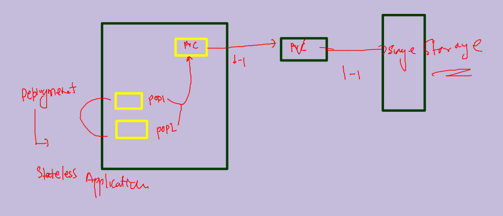
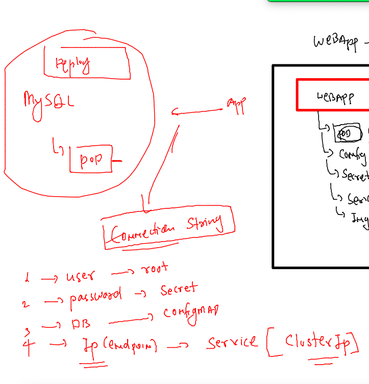
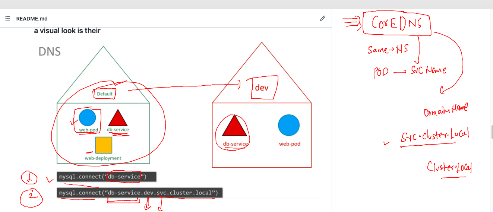
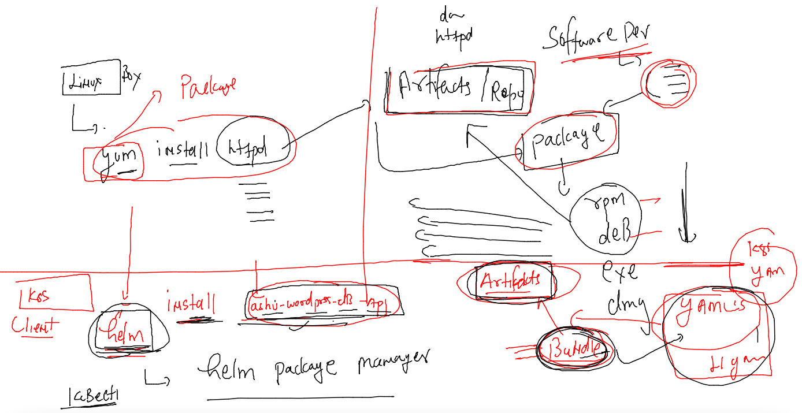

## Training plan 


### clean up namespaces  data

```
[ashu@mobi-dockerserver myimages]$ kubectl config get-contexts 
CURRENT   NAME                          CLUSTER      AUTHINFO           NAMESPACE
*         kubernetes-admin@kubernetes   kubernetes   kubernetes-admin   ashu-project
[ashu@mobi-dockerserver myimages]$ kubectl delete all --all
No resources found
[ashu@mobi-dockerserver myimages]$ 

```

### Revision 


### Docker Certification 


### kubernetes certifications 


### Deploy private container image to k8s 

### 

```
kubectl  create deployment  ashuapp --image=phx.ocir.io/axmbtg8judkl/ashuweb:mobiv1  --port 80 --dry-run=client -o yaml >privateimg.yaml

```

### deploy it 

```
[ashu@mobi-dockerserver k8s-resources]$ kubectl  create  -f  privateimg.yaml 
deployment.apps/ashuapp created
[ashu@mobi-dockerserver k8s-resources]$ kubectl  create  -f  privateimg.yaml 
Error from server (AlreadyExists): error when creating "privateimg.yaml": deployments.apps "ashuapp" already exists
[ashu@mobi-dockerserver k8s-resources]$ 
[ashu@mobi-dockerserver k8s-resources]$ kubectl  apply  -f  privateimg.yaml 
Warning: resource deployments/ashuapp is missing the kubectl.kubernetes.io/last-applied-configuration annotation which is required by kubectl apply. kubectl apply should only be used on resources created declaratively by either kubectl create --save-config or kubectl apply. The missing annotation will be patched automatically.
deployment.apps/ashuapp configured
[ashu@mobi-dockerserver k8s-resources]$ kubectl  apply  -f  privateimg.yaml 
deployment.apps/ashuapp configured
[ashu@mobi-dockerserver k8s-resources]$ 

```

### lets analyse 

```
[ashu@mobi-dockerserver ~]$ kubectl  get deploy 
NAME      READY   UP-TO-DATE   AVAILABLE   AGE
ashuapp   0/1     1            0           109s
[ashu@mobi-dockerserver ~]$ 
[ashu@mobi-dockerserver ~]$ 
[ashu@mobi-dockerserver ~]$ kubectl  get  po 
NAME                       READY   STATUS             RESTARTS   AGE
ashuapp-8469dc875b-n2b6d   0/1     ImagePullBackOff   0          2m3s
[ashu@mobi-dockerserver ~]$ kubectl get events
LAST SEEN   TYPE      REASON              OBJECT                          MESSAGE
2m14s       Normal    Scheduled           pod/ashuapp-8469dc875b-n2b6d    Successfully assigned ashu-project/ashuapp-8469dc875b-n2b6d to node3
53s         Normal    Pulling             pod/ashuapp-8469dc875b-n2b6d    Pulling image "phx.ocir.io/axmbtg8judkl/ashuweb:mobiv1"
53s         Warning   Failed              pod/ashuapp-8469dc875b-n2b6d    Failed to pull image "phx.ocir.io/axmbtg8judkl/ashuweb:mobiv1": rpc error: code = Unknown desc = failed to pull and unpack image "phx.ocir.io/axmbtg8judkl/ashuweb:mobiv1": failed to resolve reference "phx.ocir.io/axmbtg8judkl/ashuweb:mobiv1": pulling from host phx.ocir.io failed with status code [manifests mobiv1]: 403 Forbidden
53s         Warning   Failed              pod/ashuapp-8469dc875b-n2b6d    Error: ErrImagePull
26s         Normal    BackOff             pod/ashuapp-8469dc875b-n2b6d    Back-off pulling image "phx.ocir.io/axmbtg8judkl/ashuweb:mobiv1"
39s         Warning   Failed              pod/ashuapp-8469dc875b-n2b6d    Error: ImagePullBackOff
2m14s       Normal    SuccessfulCreate    replicaset/ashuapp-8469dc875b   Created pod: ashuapp-8469dc875b-n2b6d
2m14s       Normal    ScalingReplicaSet   deployment/ashuapp              Scaled up replica set ashuapp-8469dc875b to 1
[ashu@mobi-dockerserver ~]$ 

```

## storing private registry Credentials in Secret 


### creating secret to store cred

```
kubectl create secret  docker-registry  ashuimg-secret --docker-server phx.ocir.io --docker-username axmbdkl/learyme@gmail.com --docker-password "c0tGy-SQSs"  --dry-run=client -o yaml >imgsecret.yaml

```

### deploy it 

```
[ashu@mobi-dockerserver k8s-resources]$ kubectl apply -f imgsecret.yaml 
secret/ashuimg-secret configured
[ashu@mobi-dockerserver k8s-resources]$ 
[ashu@mobi-dockerserver k8s-resources]$ kubectl  get  secret 
NAME             TYPE                             DATA   AGE
ashuimg-secret   kubernetes.io/dockerconfigjson   1      91s
[ashu@mobi-dockerserver k8s-resources]$ 
[ashu@mobi-dockerserver k8s-resources]$ kubectl  get  deploy 
NAME      READY   UP-TO-DATE   AVAILABLE   AGE
ashuapp   0/1     1            0           14m

```

### updated Deployment yAML 

```
apiVersion: apps/v1
kind: Deployment
metadata:
  creationTimestamp: null
  labels:
    app: ashuapp
  name: ashuapp
spec:
  replicas: 1
  selector:
    matchLabels:
      app: ashuapp
  strategy: {}
  template:
    metadata:
      creationTimestamp: null
      labels:
        app: ashuapp
    spec:
      imagePullSecrets: # calling image secret 
      - name: ashuimg-secret # name of secret 
      containers:
      - image: phx.ocir.io/axmbtg8judkl/ashuweb:mobiv1
        name: ashuweb
        ports:
        - containerPort: 80
        resources: {}
status: {}

```

### redeploy it 

```
[ashu@mobi-dockerserver k8s-resources]$ kubectl  apply -f privateimg.yaml 
deployment.apps/ashuapp configured
[ashu@mobi-dockerserver k8s-resources]$ kubectl  get deploy 
NAME      READY   UP-TO-DATE   AVAILABLE   AGE
ashuapp   1/1     1            1           18m
[ashu@mobi-dockerserver k8s-resources]$ kubectl  get  po 
NAME                       READY   STATUS    RESTARTS   AGE
ashuapp-5cd7fcfd99-7hjms   1/1     Running   0          81s
[ashu@mobi-dockerserver k8s-resources]$ kubectl  get  po -owide
NAME                       READY   STATUS    RESTARTS   AGE   IP              NODE    NOMINATED NODE   READINESS GATES
ashuapp-5cd7fcfd99-7hjms   1/1     Running   0          87s   192.168.135.2   node3   <none>           <none>

```

### creating service 

```
[ashu@mobi-dockerserver k8s-resources]$ kubectl  get deploy 
NAME      READY   UP-TO-DATE   AVAILABLE   AGE
ashuapp   1/1     1            1           19m
[ashu@mobi-dockerserver k8s-resources]$ kubectl  expose deployment ashuapp --type  NodePort --port 80 --name ashulb1 
service/ashulb1 exposed
[ashu@mobi-dockerserver k8s-resources]$ kubectl  get  svc
NAME      TYPE       CLUSTER-IP      EXTERNAL-IP   PORT(S)        AGE
ashulb1   NodePort   10.108.120.59   <none>        80:32517/TCP   3s
[ashu@mobi-dockerserver k8s-resources]$ 

```

## taking webapp + Db example in k8s 


### Understanding PV 


### PV provisoning methods 


### PVC -- namespace Resource 


## Demo to understand PV and PVC 

### PV YAML 

```

apiVersion: v1
kind: PersistentVolume
metadata:
  name: ashu-pv-volume # name of pv 
  labels: # label of pv 
    type: ashu-pv 
spec:
  storageClassName: manual # we are creating pv manually 
  capacity:
    storage: 5Gi # 3Gi -range - 10Gi 
  accessModes: # how to use these pv by Nodes 
    - ReadWriteMany # RWO , RWM , ROM 
  hostPath: # from inside k8s nodes 
    path: "/mnt/ashu-data" # this folder will be created if not present
    type: DirectoryOrCreate # if not present then create it ```

```

### creating it 

```
[ashu@mobi-dockerserver storage-k8s]$ kubectl apply -f demo-pv.yaml 
persistentvolume/ashu-pv-volume created
[ashu@mobi-dockerserver storage-k8s]$ kubectl  get  pv
NAME              CAPACITY   ACCESS MODES   RECLAIM POLICY   STATUS      CLAIM   STORAGECLASS   REASON   AGE
ashu-pv-volume    5Gi        RWX            Retain           Available           manual                  37s
atul-pv-volume    3Gi        RWO            Retain           Available           manual                  11s
fjv-pv-volume     3Gi        RWO            Retain           Available           manual                  30s
nuno-pv-volume    3Gi        RWX            Retain           Available           manual                  11s
sofia-pv-volume   9Gi        RWX            Retain           Available           manual                  24s

```

### creating PVC 

```
apiVersion: v1
kind: PersistentVolumeClaim
metadata:
  name: ashu-pv-claim
spec:
  storageClassName: manual
  accessModes:
    - ReadWriteMany
  resources:
    requests:
      storage: 3Gi # size we need 
```

### deploy it 

```
ashu@mobi-dockerserver storage-k8s]$ kubectl  apply -f demo-pvc.yaml 
persistentvolumeclaim/ashu-pv-claim created
[ashu@mobi-dockerserver storage-k8s]$ kubectl get  pvc
NAME            STATUS   VOLUME            CAPACITY   ACCESS MODES   STORAGECLASS   AGE
ashu-pv-claim   Bound    vasco-pv-volume   3Gi        RWX            manual         8s
[ashu@mobi-dockerserver storage-k8s]$ 

```

### creating deployment 

```
[ashu@mobi-dockerserver storage-k8s]$ kubectl  create deployment ashutest --image=alpine --dry-run=client   -o yaml >demo-deploy.yaml 
```

### Deployment YAML with pvc and volume 

```
apiVersion: apps/v1
kind: Deployment
metadata:
  creationTimestamp: null
  labels:
    app: ashutest
  name: ashutest
spec:
  replicas: 1
  selector:
    matchLabels:
      app: ashutest
  strategy: {}
  template: # template 
    metadata:
      creationTimestamp: null
      labels:
        app: ashutest
    spec:
      nodeName: node3 # checking with static scheduling 
      volumes: # creating volume 
      - name: ashuvol-999
        persistentVolumeClaim: # taking storage from PVC 
          claimName: ashu-pv-claim # name of your pvc 
      containers:
      - image: alpine
        name: alpine
        volumeMounts:  # mounting volume inside container 
        - name: ashuvol-999
          mountPath: /mnt/logs/
        command: ['/bin/sh','-c','while true;do echo "hello i am `hostname -i`" >/mnt/logs/info.txt;sleep 20;done']
        resources: {}
status: {}

```

### deploy it 

```
[ashu@mobi-dockerserver storage-k8s]$ kubectl apply -f demo-deploy.yaml 
deployment.apps/ashutest created
[ashu@mobi-dockerserver storage-k8s]$ kubectl  get  deploy 
NAME       READY   UP-TO-DATE   AVAILABLE   AGE
ashutest   1/1     1            1           8s
[ashu@mobi-dockerserver storage-k8s]$ kubectl  get  po
NAME                        READY   STATUS    RESTARTS   AGE
ashutest-5785466d45-rtd2j   1/1     Running   0          12s
[ashu@mobi-dockerserver storage-k8s]$ kubectl  exec -it ashutest-5785466d45-rtd2j -- sh 
/ # cd /mnt/logs/
/mnt/logs # ls
info.txt
/mnt/logs # cat info.txt 
hello i am 192.168.135.62
/mnt/logs # 
```
### PV/PVC --Deployment -- 



## Delete resources 

```
[ashu@mobi-dockerserver storage-k8s]$ kubectl delete  all --all
pod "ashutest-5b98dd8f9-b457f" deleted
pod "ashutest-5b98dd8f9-bgf6t" deleted
deployment.apps "ashutest" deleted
replicaset.apps "ashutest-5785466d45" deleted
ashu@mobi-dockerserver storage-k8s]$ kubectl  get pvc
NAME            STATUS   VOLUME            CAPACITY   ACCESS MODES   STORAGECLASS   AGE
ashu-pv-claim   Bound    vasco-pv-volume   3Gi        RWX            manual         37m
[ashu@mobi-dockerserver storage-k8s]$ kubectl delete pvc ashu-pv-claim 
persistentvolumeclaim "ashu-pv-claim" deleted
```

## application Demo --

### creating NFS based PV 

```
apiVersion: v1
kind: PersistentVolume
metadata:
  name: ashu-pv-nfs # name of pv 
  labels: # label of pv 
    type: ashu-pv 
spec:
  storageClassName: manual # we are creating pv manually 
  capacity:
    storage: 7Gi # 3Gi -range - 10Gi 
  accessModes: # how to use these pv by Nodes 
    - ReadWriteOnce # RWO , RWM , ROM 
  nfs: # pv taking storage from NFS 
    server: 172.31.95.147 # Ip address of NFS 
    path: /common/db/ashu/ # path location on NFS server 
```

### deploy it 

```
[ashu@mobi-dockerserver storage-k8s]$ kubectl apply -f nfs-pv.yaml 
persistentvolume/ashu-pv-nfs created
[ashu@mobi-dockerserver storage-k8s]$ kubectl  get  pv ashu-pv-nfs 
NAME          CAPACITY   ACCESS MODES   RECLAIM POLICY   STATUS      CLAIM   STORAGECLASS   REASON   AGE
ashu-pv-nfs   7Gi        RWO            Retain           Available           manual                  10s
[ashu@mobi-dockerserver storage-k8s]$ 
```

### creating pvc nfs based 

```
apiVersion: v1
kind: PersistentVolumeClaim
metadata:
  name: ashu-pv-claim-nfs
spec:
  storageClassName: manual
  accessModes:
    - ReadWriteOnce # change access mode 
  resources:
    requests:
      storage: 7Gi # size we need 
```

###

```
[ashu@mobi-dockerserver storage-k8s]$ kubectl  apply -f nfs-pvc.yaml 
persistentvolumeclaim/ashu-pv-claim-nfs created
[ashu@mobi-dockerserver storage-k8s]$ kubectl  get pvc
NAME                STATUS   VOLUME        CAPACITY   ACCESS MODES   STORAGECLASS   AGE
ashu-pv-claim-nfs   Bound    ashu-pv-nfs   7Gi        RWO            manual         4s
[ashu@mobi-dockerserver storage-k8s]$ 
```

### creating configMap to store DBname info 

```
[ashu@mobi-dockerserver storage-k8s]$ kubectl  create cm ashu-db-cm --from-literal dbname=ashudb --dry-run=client -o yaml >dbcm.yaml
[ashu@mobi-dockerserver storage-k8s]$ kubectl apply -f dbcm.yaml 
configmap/ashu-db-cm created
[ashu@mobi-dockerserver storage-k8s]$ kubectl get  cm 
NAME               DATA   AGE
ashu-db-cm         1      4s
kube-root-ca.crt   1      22h
```

### creating sercret to store DBroot password info 

```
[ashu@mobi-dockerserver storage-k8s]$ kubectl  create secret generic  ashudb-pass --from-literal dbpassword="Db@098#"  --dry-run=client -o yaml >rootsecret.yaml 
[ashu@mobi-dockerserver storage-k8s]$ kubectl  apply -f rootsecret.yaml 
secret/ashudb-pass created
[ashu@mobi-dockerserver storage-k8s]$ kubectl  get secret
NAME             TYPE                             DATA   AGE
ashudb-pass      Opaque                           1      6s
ashuimg-secret   kubernetes.io/dockerconfigjson   1      152m
[ashu@mobi-dockerserver storage-k8s]$ 
```

### creating Deployment of Db 

```
kubectl create deployment ashu-db --image=mysql:5.6 --port 3306 --dry-run=client -o yaml >db-deploy.yaml 
```

### updated YAML 

```
apiVersion: apps/v1
kind: Deployment
metadata:
  creationTimestamp: null
  labels:
    app: ashu-db
  name: ashu-db
spec:
  replicas: 1
  selector:
    matchLabels:
      app: ashu-db
  strategy: {}
  template: # for creating db pods 
    metadata:
      creationTimestamp: null
      labels:
        app: ashu-db
    spec:
      volumes: # creating volume 
      - name: ashudb-vol # name of volume 
        persistentVolumeClaim: # taking from PVC 
          claimName: ashu-pv-claim-nfs # claimName 
      containers:
      - image: mysql:5.6
        name: mysql
        ports:
        - containerPort: 3306
        volumeMounts: # attaching volume to db pod 
        - name: ashudb-vol
          mountPath: /var/lib/mysql/ # default location to store databases 
        env: # to create / update values 
        - name: MYSQL_DATABASE
          valueFrom: # reading value from somewhere 
            configMapKeyRef: 
              name: ashu-db-cm  # name of cm
              key: dbname # key of cm 
        - name: MYSQL_ROOT_PASSWORD
          valueFrom:
            secretKeyRef: 
              name: ashudb-pass # name of secret 
              key: dbpassword # key of secret 
        resources: {}
status: {}

```

### deploy it 

```
[ashu@mobi-dockerserver storage-k8s]$ kubectl apply -f db-deploy.yaml 
deployment.apps/ashu-db configured
[ashu@mobi-dockerserver storage-k8s]$ kubectl  get  deploy 
NAME      READY   UP-TO-DATE   AVAILABLE   AGE
ashu-db   1/1     1            1           17s
[ashu@mobi-dockerserver storage-k8s]$ kubectl  get  po 
NAME                       READY   STATUS    RESTARTS   AGE
ashu-db-7cc5995569-v6qhl   1/1     Running   
```

### creating service of clusterIP for db endpoint or host purpose 

```
[ashu@mobi-dockerserver storage-k8s]$ kubectl  get  deploy 
NAME      READY   UP-TO-DATE   AVAILABLE   AGE
ashu-db   1/1     1            1           9m47s
[ashu@mobi-dockerserver storage-k8s]$ kubectl  expose deployment ashu-db --type ClusterIP --port 3306 --name ashu-db-server --dry-run=client -o yaml >db-svc.yaml 
[ashu@mobi-dockerserver storage-k8s]$ kubectl  apply -f db-svc.yaml 
service/ashu-db-server created
[ashu@mobi-dockerserver storage-k8s]$ kubectl  get  svc 
NAME             TYPE        CLUSTER-IP      EXTERNAL-IP   PORT(S)    AGE
ashu-db-server   ClusterIP   10.98.224.128   <none>        3306/TCP   3s
[ashu@mobi-dockerserver storage-k8s]$ 

```

### dB connection string understanding 



### Now creating webapp deployment 

### Deployment file 

```
kubectl  create deployment ashu-webapp --image=wordpress:4.8-apache  --port  80 --dry-run=client -o yaml >webapp-deploy.yaml 
```
### updating yAML 

```
apiVersion: apps/v1
kind: Deployment
metadata:
  creationTimestamp: null
  labels:
    app: ashu-webapp
  name: ashu-webapp
spec:
  replicas: 1
  selector:
    matchLabels:
      app: ashu-webapp
  strategy: {}
  template:
    metadata:
      creationTimestamp: null
      labels:
        app: ashu-webapp
    spec:
      containers:
      - image: wordpress:4.8-apache
        name: wordpress
        ports:
        - containerPort: 80
        env: # to connection DB from webapp 
        - name: WORDPRESS_DB_PASSWORD # db root password 
          valueFrom:
            secretKeyRef:
              name: ashudb-pass
              key: dbpassword
        - name: WORDPRESS_DB_HOST # hostname of DB 
          value: ashu-db-server # service name of DB deployment 
        - name: WORDPRESS_DB_NAME # db name to connect 
          valueFrom:
            configMapKeyRef:
              name: ashu-db-cm
              key: dbname
        resources: {}
status: {}

```

### deloy it 

```
[ashu@mobi-dockerserver storage-k8s]$ kubectl  apply -f webapp-deploy.yaml 
deployment.apps/ashu-webapp created
[ashu@mobi-dockerserver storage-k8s]$ kubectl  get  deploy 
NAME          READY   UP-TO-DATE   AVAILABLE   AGE
ashu-db       1/1     1            1           111m
ashu-webapp   0/1     1            0           7s
[ashu@mobi-dockerserver storage-k8s]$ kubectl  get  po
NAME                           READY   STATUS    RESTARTS   AGE
ashu-db-7cc5995569-v6qhl       1/1     Running   0          111m
ashu-webapp-86c975b779-hnftg   1/1     Running   0          14s
[ashu@mobi-dockerserver storage-k8s]$ kubectl  get  deploy 
NAME          READY   UP-TO-DATE   AVAILABLE   AGE
ashu-db       1/1     1            1           111m
ashu-webapp   1/1     1            1           18s
```

### DB connection and CoreDNs understanding 



### creating svc 

```
[ashu@mobi-dockerserver storage-k8s]$ kubectl  get  deploy 
NAME          READY   UP-TO-DATE   AVAILABLE   AGE
ashu-db       1/1     1            1           124m
ashu-webapp   1/1     1            1           13m
[ashu@mobi-dockerserver storage-k8s]$ kubectl  expose deployment ashu-webapp --type NodePort --port 80 --name ashu-app-svc --dry-run=client -o yaml >web-svc.yaml 
[ashu@mobi-dockerserver storage-k8s]$ kubectl  apply -f web-svc.yaml 
service/ashu-app-svc created
[ashu@mobi-dockerserver storage-k8s]$ kubectl  get  svc
NAME             TYPE        CLUSTER-IP      EXTERNAL-IP   PORT(S)        AGE
ashu-app-svc     NodePort    10.100.60.229   <none>        80:30276/TCP   3s
ashu-db-server   ClusterIP   10.98.224.128   <none>        3306/TCP       114m
[ashu@mobi-dockerserver storage-k8s]$ 

```

### Introduction to Helm 



### fixing kubeconfig permission for helm  v3 

```
[jorge@mobi-dockerserver ~]$ helm version 
WARNING: Kubernetes configuration file is group-readable. This is insecure. Location: /home/jorge/.kube/config
WARNING: Kubernetes configuration file is world-readable. This is insecure. Location: /home/jorge/.kube/config
version.BuildInfo{Version:"v3.10.0-rc.1", GitCommit:"ce66412a723e4d89555dc67217607c6579ffcb21", GitTreeState:"clean", GoVersion:"go1.18.6"}
[jorge@mobi-dockerserver ~]$ chmod  400 ~/.kube/config 
[jorge@mobi-dockerserver ~]$ helm version 
version.BuildInfo{Version:"v3.10.0-rc.1", GitCommit:"ce66412a723e4d89555dc67217607c6579ffcb21", GitTreeState:"clean", GoVersion:"go1.18.6"}
[jorge@mobi-dockerserver ~]$ 

```

### searching packages in artifcats HUB 

```
 1001  helm search hub 
 1002  history 
 1003  helm search hub wordpress
 1004* history
 1005  helm search hub nginx 

```

### adding repo in helm client 

```
[ashu@mobi-dockerserver ~]$ helm repo add bitnami https://charts.bitnami.com/bitnami
"bitnami" has been added to your repositories
[ashu@mobi-dockerserver ~]$ 
[ashu@mobi-dockerserver ~]$ helm repo ls
NAME   	URL                               
bitnami	https://charts.bitnami.com/bitnami
[ashu@mobi-dockerserver ~]$ 


```

### deploy nginx image using helm 

```
[ashu@mobi-dockerserver ~]$ helm repo ls
NAME   	URL                               
bitnami	https://charts.bitnami.com/bitnami
[ashu@mobi-dockerserver ~]$ 
[ashu@mobi-dockerserver ~]$ helm install ashu-nginx-app  bitnami/nginx 
NAME: ashu-nginx-app
LAST DEPLOYED: Wed Sep 21 14:05:39 2022
NAMESPACE: ashu-project
STATUS: deployed
REVISION: 1
TEST SUITE: None
NOTES:
CHART NAME: nginx
CHART VERSION: 13.2.6
APP VERSION: 1.23.1

** Please be patient while the chart is being deployed **
NGINX can be accessed through the following DNS name from within your cluster:

    ashu-nginx-app.ashu-project.svc.cluster.local (port 80)

To access NGINX from outside the cluster, follow the steps below:

1. Get the NGINX URL by running these commands:

  NOTE: It may take a few minutes for the LoadBalancer IP to be available.
        Watch the status with: 'kubectl get svc --namespace ashu-project -w ashu-nginx-app'

    export SERVICE_PORT=$(kubectl get --namespace ashu-project -o jsonpath="{.spec.ports[0].port}" services ashu-nginx-app)
    export SERVICE_IP=$(kubectl get svc --namespace ashu-project ashu-nginx-app -o jsonpath='{.status.loadBalancer.ingress[0].ip}')
    echo "http://${SERVICE_IP}:${SERVICE_PORT}"
[ashu@mobi-dockerserver ~]$ 

```

### verify it 

```
[ashu@mobi-dockerserver ~]$ kubectl  get  deploy 
NAME             READY   UP-TO-DATE   AVAILABLE   AGE
ashu-nginx-app   1/1     1            1           62s
[ashu@mobi-dockerserver ~]$ kubectl  get  rs
NAME                        DESIRED   CURRENT   READY   AGE
ashu-nginx-app-65c47dc9c4   1         1         1       73s
[ashu@mobi-dockerserver ~]$ kubectl  get  po
NAME                              READY   STATUS    RESTARTS   AGE
ashu-nginx-app-65c47dc9c4-tkgd7   1/1     Running   0          76s
[ashu@mobi-dockerserver ~]$ kubectl  get  svc
NAME             TYPE           CLUSTER-IP      EXTERNAL-IP   PORT(S)        AGE
ashu-nginx-app   LoadBalancer   10.111.78.137   <pending>     80:30333/TCP   78s
```

### pulling helm chart and check it 

```
 1019  helm pull  bitnami/nginx 
 1020  ls
 1021  tar xvzf nginx-13.2.6.tgz 
 1022  history 
[ashu@mobi-dockerserver ~]$ ls
deployment.yaml  hpa.yaml      kubectl   nginx             serviceaccount.yaml
hello.java       ingress.yaml  myimages  nginx-13.2.6.tgz  service.yaml
[ashu@mobi-dockerserver ~]$ cd  nginx/
[ashu@mobi-dockerserver nginx]$ ls
Chart.lock  charts  Chart.yaml  README.md  templates  values.schema.json  values.yaml
[ashu@mobi-dockerserver nginx]$ ls templates/
deployment.yaml      _helpers.tpl  NOTES.txt             server-block-configmap.yaml  svc.yaml
extra-list.yaml      hpa.yaml      pdb.yaml              serviceaccount.yaml          tls-secrets.yaml
health-ingress.yaml  ingress.yaml  prometheusrules.yaml  servicemonitor.yaml
[ashu@mobi-dockerserver nginx]$ 

```

### argocd cross checking 

```
[ashu@mobi-dockerserver ~]$ kubectl  get  pod -n argocd 
NAME                                                READY   STATUS    RESTARTS   AGE
argocd-application-controller-0                     1/1     Running   0          9h
argocd-applicationset-controller-6676c4d655-2mcqs   1/1     Running   0          9h
argocd-dex-server-5f9bd56758-89ffm                  1/1     Running   0          9h
argocd-notifications-controller-5bc766fc6d-xhkh2    1/1     Running   0          9h
argocd-redis-6fd7cbd95d-2ks56                       1/1     Running   0          9h
argocd-repo-server-5bb545d667-756wm                 1/1     Running   0          9h
argocd-server-6b88fbcbb8-7zzbq                      1/1     Running   0          9h
[ashu@mobi-dockerserver ~]$ kubectl  get svc  -n argocd 
NAME                                      TYPE        CLUSTER-IP       EXTERNAL-IP   PORT(S)                      AGE
argocd-applicationset-controller          ClusterIP   10.102.122.188   <none>        7000/TCP,8080/TCP            9h
argocd-dex-server                         ClusterIP   10.106.178.206   <none>        5556/TCP,5557/TCP,5558/TCP   9h
argocd-metrics                            ClusterIP   10.106.133.49    <none>        8082/TCP                     9h
argocd-notifications-controller-metrics   ClusterIP   10.101.120.24    <none>        9001/TCP                     9h
argocd-redis                              ClusterIP   10.110.90.174    <none>        6379/TCP                     9h
argocd-repo-server                        ClusterIP   10.111.106.21    <none>        8081/TCP,8084/TCP            9h
argocd-server                             NodePort    10.102.98.22     <none>        80:31936/TCP,443:31935/TCP   9h
argocd-server-metrics                     ClusterIP   10.106.152.164   <none>        8083/TCP                     9h
[ashu@mobi-dockerserver ~]$ kubectl  get secret   -n argocd 


[ashu@mobi-dockerserver ~]$ kubectl  get secret   -n argocd 
NAME                                        TYPE     DATA   AGE
argocd-initial-admin-secret                 Opaque   1      9h
argocd-notifications-secret                 Opaque   0      9h
argocd-secret                               Opaque   5      9h
cluster-kubernetes.default.svc-3396314289   Opaque   3      8h
[ashu@mobi-dockerserver ~]$ kubectl describe  secret argocd-initial-admin-secret   -n argocd 
Name:         argocd-initial-admin-secret
Namespace:    argocd
Labels:       <none>
Annotations:  <none>

Type:  Opaque

Data
====
password:  16 bytes
[ashu@mobi-dockerserver ~]$ kubectl get   secret argocd-initial-admin-secret -o yaml   -n argocd 


[ashu@mobi-dockerserver ~]$ kubectl get   secret argocd-initial-admin-secret -o yaml   -n argocd 
apiVersion: v1
data:
  password: M1RwTEk2UTNOV3dGVnpHUg==
kind: Secret
metadata:
  creationTimestamp: "2022-09-21T05:20:27Z"
  name: argocd-initial-admin-secret
  namespace: argocd
  resourceVersion: "316888"
  uid: 243f6c40-06a0-4405-9dbb-5fd5bf610026
type: Opaque
[ashu@mobi-dockerserver ~]$ 
[ashu@mobi-dockerserver ~]$ 
[ashu@mobi-dockerserver ~]$ echo "M1RwTEk2UTNOV3dGVnpHUg=="  |  base64 -d
3TpLI6Q3NWwFVzGR[ashu@mobi-dockerserver ~]$ 
[ashu@mobi-dockerserver ~]$ 
[ashu@mobi-dockerserver ~]$ 


```


