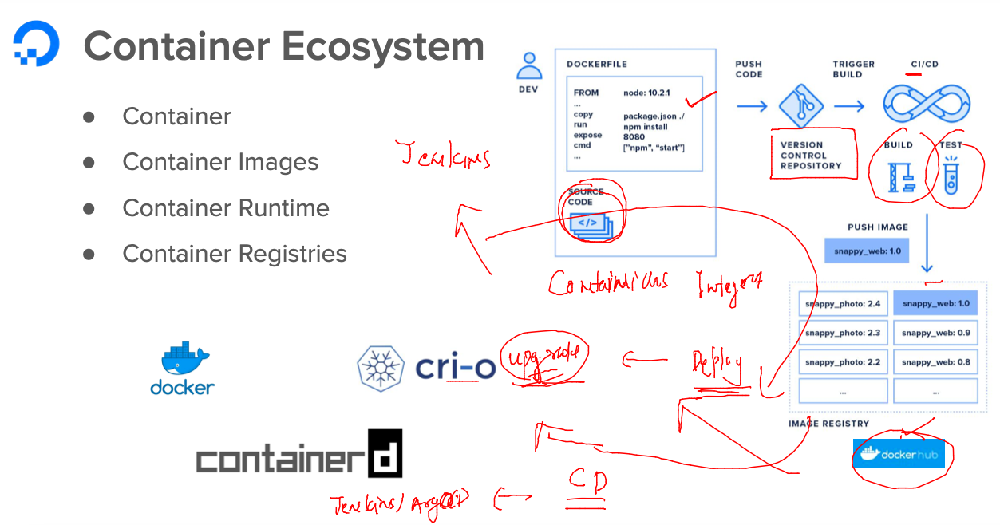
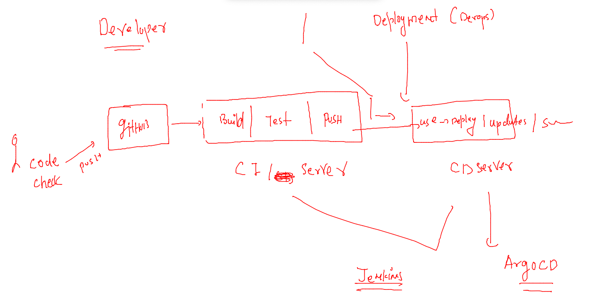
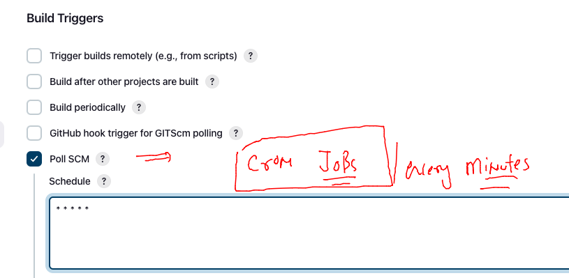

## Training plan 


## Training plan 


### lets check connection to k8s cluster 

```
[ashu@mobi-dockerserver myimages]$ kubectl  get  nodes
NAME            STATUS   ROLES           AGE    VERSION
control-plane   Ready    control-plane   6d2h   v1.25.0
node1           Ready    <none>          6d2h   v1.25.0
node2           Ready    <none>          6d2h   v1.25.0
node3           Ready    <none>          6d2h   v1.25.0
[ashu@mobi-dockerserver myimages]$ kubectl config get-contexts 
CURRENT   NAME                          CLUSTER      AUTHINFO           NAMESPACE
*         kubernetes-admin@kubernetes   kubernetes   kubernetes-admin   ashu-project
[ashu@mobi-dockerserver myimages]$ 

```

### Deleting all resources in personal Namespaces 

```
[ashu@mobi-dockerserver myimages]$ kubectl  delete  deploy,svc,hpa --all
No resources found
```

## Introduction to CI & CD 

### for CI& CD purpose we will use -- Jenkins 




### Understanding CICD 



## Steps 

### creating gitrepo and clone it to docker server 

```
[ashu@mobi-dockerserver myimages]$ git clone  https://github.com/redashu/ashumobi-ci.git
Cloning into 'ashumobi-ci'...
remote: Enumerating objects: 3, done.
remote: Counting objects: 100% (3/3), done.
remote: Total 3 (delta 0), reused 0 (delta 0), pack-reused 0
Receiving objects: 100% (3/3), done.
[ashu@mobi-dockerserver myimages]$ ls
ashu-compose   ashu-javawebapp  ashu-multistage  k8s-resources  webapps_ashu
ashu-customer  ashumobi-ci      javacode         pythoncode
[ashu@mobi-dockerserver myimages]$ cd  ashumobi-ci/
[ashu@mobi-dockerserver ashumobi-ci]$ 

```

### step 2 pushing code to github 

```
 git  add . 
[ashu@mobi-dockerserver ashumobi-ci]$ ls
Dockerfile  docker.png  index.html  README.md
[ashu@mobi-dockerserver ashumobi-ci]$ git commit -m  "app code v1 "
Author identity unknown

*** Please tell me who you are.

Run

  git config --global user.email "you@example.com"
  git config --global user.name "Your Name"

to set your account's default identity.
Omit --global to set the identity only in this repository.

fatal: unable to auto-detect email address (got 'ashu@mobi-dockerserver.(none)')
[ashu@mobi-dockerserver ashumobi-ci]$ git config --global user.email ashutoshh@linux.com
[ashu@mobi-dockerserver ashumobi-ci]$ git config --global user.name  redashu

===
[ashu@mobi-dockerserver ashumobi-ci]$ git push origin master
Enumerating objects: 7, done.
Counting objects: 100% (7/7), done.
Delta compression using up to 2 threads
Compressing objects: 100% (5/5), done.
Writing objects: 100% (6/6), 19.39 KiB | 19.39 MiB/s, done.
Total 6 (delta 0), reused 0 (delta 0), pack-reused 0
To https://github.com/redashu/ashumobi-ci.git
   f43c4c4..2d82d8a  master -> master
```

### configuring auto build trigger in Jenkins using poll scm 




