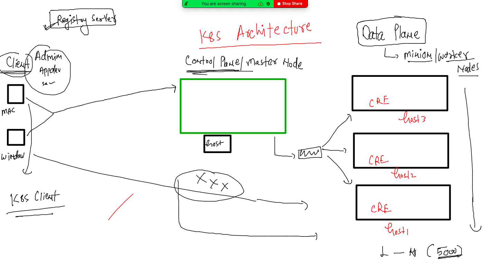
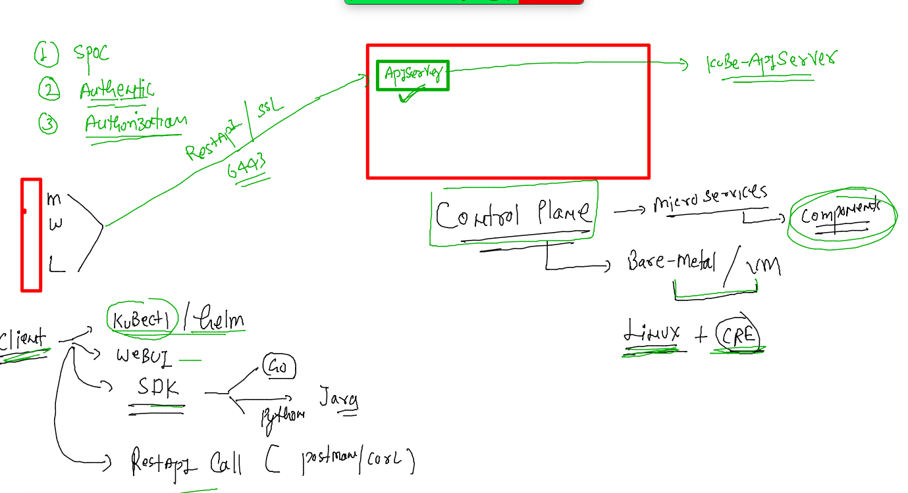
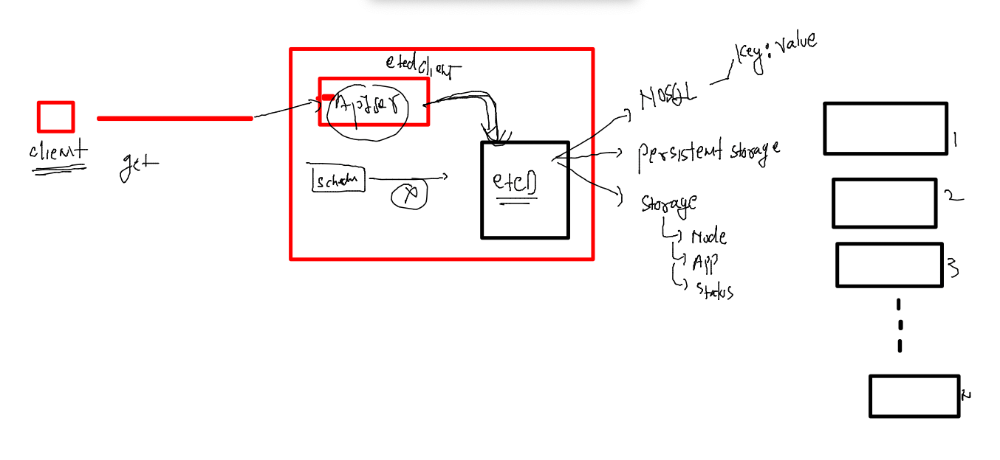
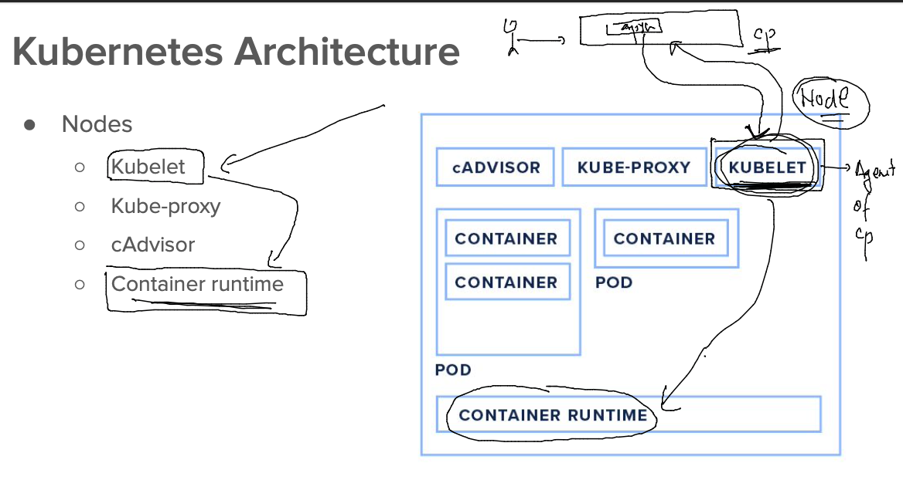
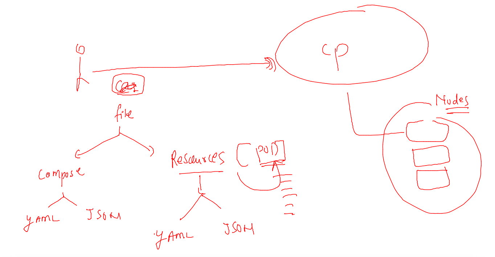
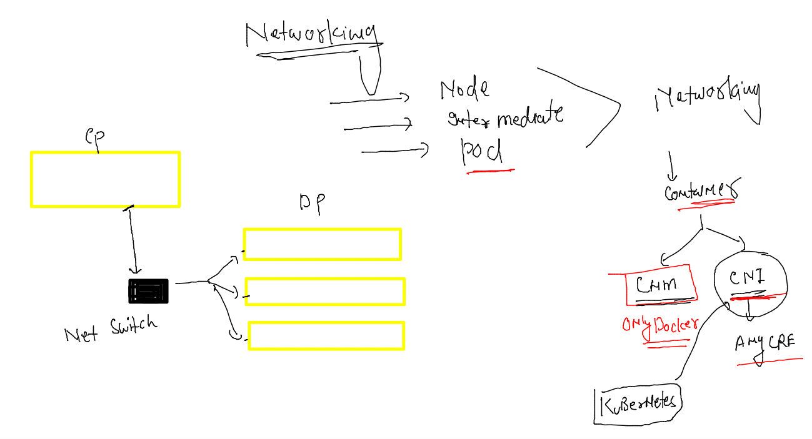
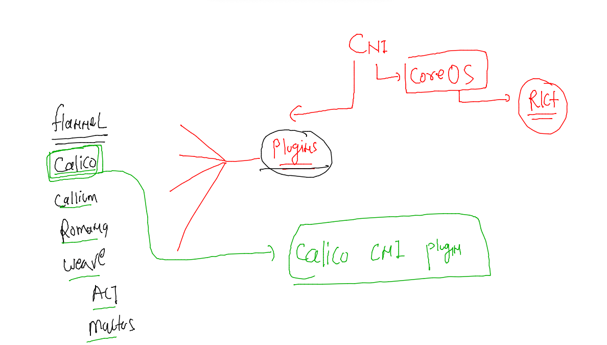
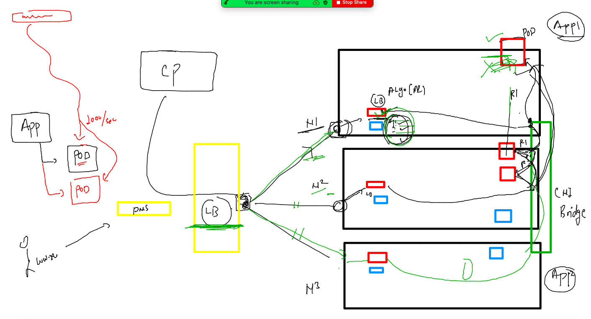
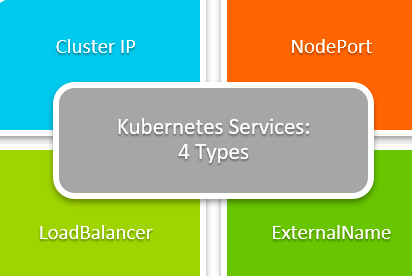

## Training plan 


## K8s architecture is important to Understand 



### COntrol plane component  --- Kube-apiServer 



### Installing kubectl client side software on Mac 

```
fire@ashutoshhs-MacBook-Air ~ %  curl -LO "https://dl.k8s.io/release/$(curl -L -s https://dl.k8s.io/release/stable.txt)/bin/darwin/amd64/kubectl"
  % Total    % Received % Xferd  Average Speed   Time    Time     Time  Current
                                 Dload  Upload   Total   Spent    Left  Speed
100   138  100   138    0     0    351      0 --:--:-- --:--:-- --:--:--   350
100 47.8M  100 47.8M    0     0  4309k      0  0:00:11  0:00:11 --:--:-- 5328k
fire@ashutoshhs-MacBook-Air ~ % 
fire@ashutoshhs-MacBook-Air ~ % ls
Applications		Downloads		Music			certs			kubectl
Desktop			Library			Pictures		config_file_create.sh	sa.kubeconfig
Documents		Movies			Public			go			svc.yml
fire@ashutoshhs-MacBook-Air ~ % sudo mv kubectl /usr/local/bin 
Password:
fire@ashutoshhs-MacBook-Air ~ % sudo chmod +x  /usr/local/bin/kubectl 
fire@ashutoshhs-MacBook-Air ~ % kubectl version --client 
WARNING: This version information is deprecated and will be replaced with the output from kubectl version --short.  Use --output=yaml|json to get the full version.
Client Version: version.Info{Major:"1", Minor:"25", GitVersion:"v1.25.0", GitCommit:"a866cbe2e5bbaa01cfd5e969aa3e033f3282a8a2", GitTreeState:"clean", BuildDate:"2022-08-23T17:44:59Z", GoVersion:"go1.19", Compiler:"gc", Platform:"darwin/amd64"}
Kustomize Version: v4.5.7
fire@ashutoshhs-MacBook-Air ~ % kubectl version --client  -o yaml 
clientVersion:
  buildDate: "2022-08-23T17:44:59Z"
  compiler: gc
  gitCommit: a866cbe2e5bbaa01cfd5e969aa3e033f3282a8a2
  gitTreeState: clean
  gitVersion: v1.25.0
  goVersion: go1.19
  major: "1"
  minor: "25"
  platform: darwin/amd64
kustomizeVersion: v4.5.7

fire@ashutoshhs-MacBook-Air ~ % kubectl version --client  -o json 
{
  "clientVersion": {
    "major": "1",
    "minor": "25",
    "gitVersion": "v1.25.0",
    "gitCommit": "a866cbe2e5bbaa01cfd5e969aa3e033f3282a8a2",
    "gitTreeState": "clean",
    "buildDate": "2022-08-23T17:44:59Z",
    "goVersion": "go1.19",
    "compiler": "gc",
    "platform": "darwin/amd64"
  },
  "kustomizeVersion": "v4.5.7"
}


```

## TO install on windows & linux systems use below link 

[click](https://kubernetes.io/docs/tasks/tools/)


## COntrol plane auth file location for clients 

```
[root@control-plane ~]# cd  /etc/kubernetes/
[root@control-plane kubernetes]# ls
admin.conf 
```

### lets check connection b/w client and apiserver 

```
fire@ashutoshhs-MacBook-Air ~ % cd ~/Desktop
fire@ashutoshhs-MacBook-Air Desktop % ls
ANIPL				awscred5thsept.txt		k8sarch.png			spinnaker
admin.conf.txt			hello.java			new_user_credentials (1).csv	thexyzcompany
apis.png			id_rsa.pub			ordertraining
fire@ashutoshhs-MacBook-Air Desktop % 
fire@ashutoshhs-MacBook-Air Desktop % 
fire@ashutoshhs-MacBook-Air Desktop % 
fire@ashutoshhs-MacBook-Air Desktop % kubectl  get  nodes  --kubeconfig  admin.conf.txt 
NAME            STATUS   ROLES           AGE    VERSION
control-plane   Ready    control-plane   2d3h   v1.25.0
node1           Ready    <none>          2d3h   v1.25.0
node2           Ready    <none>          2d3h   v1.25.0
node3           Ready    <none>          2d3h   v1.25.0
fire@ashutoshhs-MacBook-Air Desktop % 
fire@ashutoshhs-MacBook-Air Desktop % kubectl  cluster-info   --kubeconfig  admin.conf.txt 
Kubernetes control plane is running at https://44.209.211.99:6443
CoreDNS is running at https://44.209.211.99:6443/api/v1/namespaces/kube-system/services/kube-dns:dns/proxy

To further debug and diagnose cluster problems, use 'kubectl cluster-info dump'.
fire@ashutoshhs-MacBook-Air Desktop % 


```

### linux client setup 

```
ashu@mobi-dockerserver myimages]$ wget http://44.209.211.99/admin.conf
--2022-09-15 09:06:01--  http://44.209.211.99/admin.conf
Connecting to 44.209.211.99:80... connected.
HTTP request sent, awaiting response... 200 OK
Length: 5637 (5.5K) [text/plain]
Saving to: ‘admin.conf’

100%[============================================================>] 5,637       --.-K/s   in 0s      

2022-09-15 09:06:01 (293 MB/s) - ‘admin.conf’ saved [5637/5637]

[ashu@mobi-dockerserver myimages]$ mkdir ~/.kube
[ashu@mobi-dockerserver myimages]$ cp -v admin.conf   ~/.kube/config 
‘admin.conf’ -> ‘/home/ashu/.kube/config’
[ashu@mobi-dockerserver myimages]$ kubectl   get  nodes
NAME            STATUS   ROLES           AGE    VERSION
control-plane   Ready    control-plane   2d3h   v1.25.0
node1           Ready    <none>          2d3h   v1.25.0
node2           Ready    <none>          2d3h   v1.25.0
```

## Etcd on control plane 



## kubernetes worker / Minion components 



## Understanding Pod 


### creating resources in K8s 



## Pods 

### Example 1 

```
apiVersion: v1 
kind: Pod # type of resource 
metadata: # info about resource 
  name: ashupod-1234  # name of pod 
spec: # application info 
  containers:
  - name: ashuc1
    image: alpine 
    command: ["/bin/sh","-c","ping fb.com"] # default process of container 
```

### deploy pod 

```
[ashu@mobi-dockerserver k8s-resources]$ ls
ashupod1.yaml
[ashu@mobi-dockerserver k8s-resources]$ kubectl  apply -f ashupod1.yaml 
pod/ashupod-1234 created
[ashu@mobi-dockerserver k8s-resources]$ kubectl   get  pods
NAME            READY   STATUS    RESTARTS   AGE
ashupod-1234    1/1     Running   0          13s
sofiapod-1234   1/1     Running   0          7s
[ashu@mobi-dockerserver k8s-resources]$ 


```

### checking pod info 

```
[ashu@mobi-dockerserver ~]$ kubectl   get   nodes
NAME            STATUS   ROLES           AGE    VERSION
control-plane   Ready    control-plane   2d4h   v1.25.0
node1           Ready    <none>          2d4h   v1.25.0
node2           Ready    <none>          2d4h   v1.25.0
node3           Ready    <none>          2d4h   v1.25.0
[ashu@mobi-dockerserver ~]$ kubectl  get  pods  ashupod-1234  
NAME           READY   STATUS    RESTARTS   AGE
ashupod-1234   1/1     Running   0          5m58s
[ashu@mobi-dockerserver ~]$ kubectl  get  pods  ashupod-1234   -o wide
NAME           READY   STATUS    RESTARTS   AGE    IP                NODE    NOMINATED NODE   READINESS GATES
ashupod-1234   1/1     Running   0          6m4s   192.168.166.143   node1   <none>           <none>
[ashu@mobi-dockerserver ~]$ 

```

### checking pod container output 

```
[ashu@mobi-dockerserver ~]$ kubectl   logs  ashupod-1234 
PING fb.com (157.240.24.35): 56 data bytes
64 bytes from 157.240.24.35: seq=0 ttl=40 time=30.358 ms
64 bytes from 157.240.24.35: seq=1 ttl=40 time=30.242 ms
64 bytes from 157.240.24.35: seq=2 ttl=40 time=30.197 ms
64 bytes from 157.240.24.35: seq=3 ttl=40 time=30.467 ms

```

### access shell of container inside pod 

```
ashu@mobi-dockerserver ~]$ kubectl  exec -it  ashupod-1234  -- sh 
/ # 
/ # 
/ # cat  /etc/os-release 
NAME="Alpine Linux"
ID=alpine
VERSION_ID=3.16.2
PRETTY_NAME="Alpine Linux v3.16"
HOME_URL="https://alpinelinux.org/"
BUG_REPORT_URL="https://gitlab.alpinelinux.org/alpine/aports/-/issues"
/ # ls
bin    dev    etc    home   lib    media  mnt    opt    proc   root   run    sbin   srv    sys    tmp    usr    var
/ # exit

```

### describe pod info 

```
[ashu@mobi-dockerserver ~]$ kubectl  describe  pod  ashupod-1234 
Name:             ashupod-1234
Namespace:        default
Priority:         0
Service Account:  default
Node:             node1/172.31.83.42
Start Time:       Thu, 15 Sep 2022 10:28:13 +0000
Labels:           <none>
Annotations:      cni.projectcalico.org/containerID: 3a8da0dc9e096d1f1f7913378be473db96e3f564babf43763330e644fa7da79d
                  cni.projectcalico.org/podIP: 192.168.166.143/32
                  cni.projectcalico.org/podIPs: 192.168.166.143/32
Status:           Running
IP:               192.168.166.143
IPs:
  IP:  192.168.166.143
Containers:
  ashuc1:
    Container ID:  containerd://425a1f3f7f662334bd4bf0f504c137e0f2324c5a0b705e81c8d07a6fb9ba9652
    Image:         alpine
    Image ID:      docker.io/library/alpine@sha256:bc41182d7ef5ffc53a40b044e725193bc10142a1243f395ee852a8d9730fc2ad
    Port:          <none>
    Host Port:     <none>
    Command:
      /bin/sh
      -c
      ping fb.com
    State:          Running
      Started:      Thu, 15 Sep 2022 10:28:15 +0000
    Ready:          True
    Restart Count:  0
    Environment:    <none>
    Mounts:
      /var/run/secrets/kubernetes.io/serviceaccount from kube-api-access-zkf4s (ro)
Conditions:
  Type              Status
  Initialized       True 
  Ready             True 
  ContainersReady   True 
  PodScheduled      True 
Volumes:
  kube-api-access-zkf4s:
    Type:                    Projected (a volume that contains injected data from multiple sources)
    TokenExpirationSeconds:  3607
    ConfigMapName:           kube-root-ca.crt
    ConfigMapOptional:       <nil>
    DownwardAPI:             true
QoS Class:                   BestEffort
Node-Selectors:              <none>
Tolerations:                 node.kubernetes.io/not-ready:NoExecute op=Exists for 300s
                             node.kubernetes.io/unreachable:NoExecute op=Exists for 300s
Events:
  Type    Reason     Age   From               Message
  ----    ------     ----  ----               -------
  Normal  Scheduled  14m   default-scheduler  Successfully assigned default/ashupod-1234 to node1
  Normal  Pulling    14m   kubelet            Pulling image "alpine"
  Normal  Pulled     14m   kubelet            Successfully pulled image "alpine" in 524.971083ms
  Normal  Created    14m   kubelet            Created container ashuc1
  Normal  Started    14m   kubelet            Started container ashuc1
```

### delete pod 

```
[ashu@mobi-dockerserver ~]$ kubectl  delete  pod ashupod-1234
pod "ashupod-1234" deleted

```

## webapp -- Frontend app 

### sample to deploy in a pod and generating yaml 

```
kubectl  run  ashupod1  --image=docker.io/dockerashu/ashuapp:mobiv11 --port 80 --dry-run=client -o yaml  >autopod.yaml 
```

### -- 

```
361  kubectl  run  ashupod1  --image=docker.io/dockerashu/ashuapp:mobiv11 --port 80 --dry-run=client -o yaml 
  362  kubectl  run  ashupod1  --image=docker.io/dockerashu/ashuapp:mobiv11 --port 80 --dry-run=client -o json 
```

### deploy 

```
[ashu@mobi-dockerserver k8s-resources]$ kubectl apply -f autopod.yaml 
pod/ashupod1 created
[ashu@mobi-dockerserver k8s-resources]$ kubectl  get po 
NAME            READY   STATUS    RESTARTS   AGE
aseemautopod    1/1     Running   0          65s
ashupod1        1/1     Running   0          4s
ricardo-pod-1   1/1     Running   0          99s
ritpod1         1/1     Running   0          3m9s
vascopod1       1/1     Running   0          3m10s
[ashu@mobi-dockerserver k8s-resources]$ kubectl  get po -o wide
NAME            READY   STATUS    RESTARTS   AGE     IP                NODE    NOMINATED NODE   READINESS GATES
aseemautopod    1/1     Running   0          76s     192.168.135.31    node3   <none>           <none>
ashupod1        1/1     Running   0          15s     192.168.104.32    node2   <none>           <none>
filipe-pod1     1/1     Running   0          7s      192.168.135.32    node3   <none>           <none>
ricardo-pod-1   1/1     Running   0     
```

## Networking in k8s 



### calico CNI 



### More info about CNI plugin 


## overall netowrking design with LB 



### service type in k8s 



### Nodeport service 

```
[ashu@mobi-dockerserver k8s-resources]$ kubectl   create  service 
Create a service using a specified subcommand.

Aliases:
service, svc

Available Commands:
  clusterip      Create a ClusterIP service
  externalname   Create an ExternalName service
  loadbalancer   Create a LoadBalancer service
  nodeport       Create a NodePort service

```

### creating it 

```
kubectl   create  service nodeport  ashulb1  --tcp  1234:80  --dry-run=client -o yaml >nodeport.yaml 
[ashu@mobi-dockerserver k8s-resources]$ kubectl  apply -f nodeport.yaml 
service/ashulb1 created
[ashu@mobi-dockerserver k8s-resources]$ kubectl  get  svc
NAME           TYPE        CLUSTER-IP       EXTERNAL-IP   PORT(S)          AGE
ashulb1        NodePort    10.102.103.171   <none>        1234:32473/TCP   9s
```

### updating lable of pod 

```
[ashu@mobi-dockerserver k8s-resources]$ kubectl  replace -f autopod.yaml  --force 
pod "ashupod1" deleted
pod/ashupod1 replaced
[ashu@mobi-dockerserver k8s-resources]$ kubectl  get  po ashupod1  --show-labels
NAME       READY   STATUS    RESTARTS   AGE   LABELS
ashupod1   1/1     Running   0          2s    x=helloashu
[ashu@mobi-dockerserver k8s-resources]$ 

```

### YAML of nOdeport 

```
apiVersion: v1
kind: Service # means create Internal LB 
metadata:
  creationTimestamp: null
  labels:
    app: ashulb1
  name: ashulb1 # name of LB 
spec:
  ports:
  - name: 1234-80
    port: 1234 # service / LB port 
    protocol: TCP
    targetPort: 80 # pod port 
  selector: # pod finder using below given label 
    x: helloashu # exact label of pod 
  type: NodePort # type of service 
status:
  loadBalancer: {}

```

### deploy it again 

```
kubectl apply -f nodeport.yaml
--
[ashu@mobi-dockerserver k8s-resources]$ kubectl  get po ashupod1 -o wide
NAME       READY   STATUS    RESTARTS   AGE   IP               NODE    NOMINATED NODE   READINESS GATES
ashupod1   1/1     Running   0          10m   192.168.104.40   node2   <none>           <none>
[ashu@mobi-dockerserver k8s-resources]$ kubectl  get po ashupod1 --show-labels
NAME       READY   STATUS    RESTARTS   AGE   LABELS
ashupod1   1/1     Running   0          10m   x=helloashu
[ashu@mobi-dockerserver k8s-resources]$ 
[ashu@mobi-dockerserver k8s-resources]$ kubectl  get svc ashulb1 -o wide 
NAME      TYPE       CLUSTER-IP       EXTERNAL-IP   PORT(S)          AGE   SELECTOR
ashulb1   NodePort   10.102.103.171   <none>        1234:32473/TCP   22m   x=helloashu
[ashu@mobi-dockerserver k8s-resources]$ kubectl  get  ep ashulb1 
NAME      ENDPOINTS           AGE
ashulb1   192.168.104.40:80   22m
[ashu@mobi-dockerserver k8s-r
```


