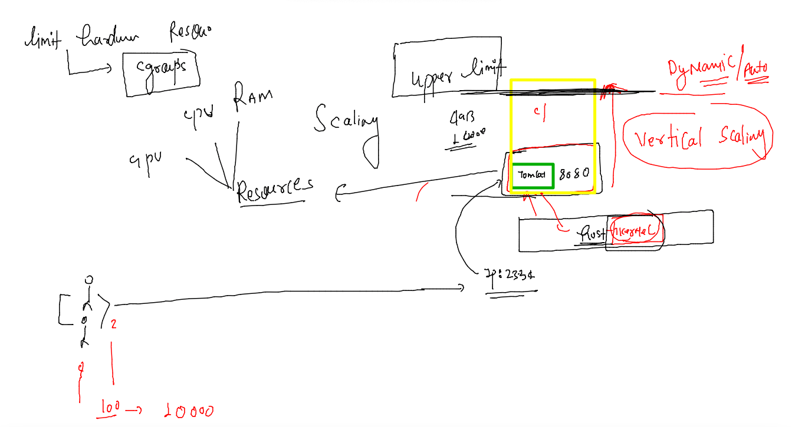
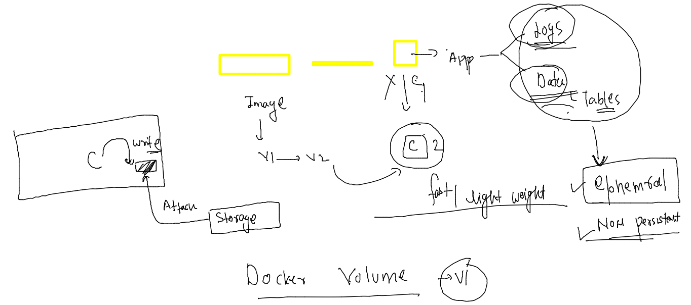

## Training plan 


## Demo Docker context  

```
 21  ssh-keygen 
   22  ssh-copy-id  remote@52.200.191.206
   23  history 
   24  ssh  remote@52.200.191.206
   25  docker  context  ls
  
   27  docker  context  create  mobi-dockerserver  --docker "host=ssh://remote@52.200.191.206" 
   28  docker  context  ls
   29  docker  context use mobi-dockerserver 

```

## Dockerfile Tomcat example 

### source code 

```
[ashu@mobi-dockerserver myimages]$ ls
ashu-compose  javacode  pythoncode  webapps_ashu
[ashu@mobi-dockerserver myimages]$ mkdir  ashu-javawebapp
[ashu@mobi-dockerserver myimages]$ cd  ashu-javawebapp/
[ashu@mobi-dockerserver ashu-javawebapp]$ git clone https://github.com/redashu/javawebapp.git
Cloning into 'javawebapp'...
remote: Enumerating objects: 71, done.
remote: Counting objects: 100% (71/71), done.
remote: Compressing objects: 100% (67/67), done.
remote: Total 71 (delta 31), reused 5 (delta 0), pack-reused 0
Receiving objects: 100% (71/71), 50.95 KiB | 8.49 MiB/s, done.
Resolving deltas: 100% (31/31), done.
[ashu@mobi-dockerserver ashu-javawebapp]$ ls  
javawebapp
[ashu@mobi-dockerserver ashu-javawebapp]$ ls  javawebapp/
Dockerfile  myapp  README.md
[ashu@mobi-dockerserver ashu-javawebapp

````

### running compose file 

```
[ashu@mobi-dockerserver ashu-javawebapp]$ docker-compose up -d 
[+] Running 1/1
 ⠿ Container ashujc1  Started                                                                    1.0s
[ashu@mobi-dockerserver ashu-javawebapp]$ docker-compose ps
NAME                COMMAND             SERVICE             STATUS              PORTS
ashujc1             "catalina.sh run"   ashujavaapp         running             0.0.0.0:2244->8080/tcp, :::2244->8080/tcp
[ashu@mobi-dockerserver ashu-javawebapp]$ docker-compose  images
Container           Repository          Tag                 Image Id            Size
ashujc1             ashujavaweb         appv1               6db97f49e178        475MB
[ashu@mobi-dockerserver ashu-javaw
```

### rebuild docker image 

```
[ashu@mobi-dockerserver ashu-javawebapp]$ docker-compose up -d --build 
[+] Building 0.2s (10/10) FINISHED                                                                    
 => [internal] load build definition from Dockerfile                                             0.0s
 => => transferring dockerfile: 32B                                                              0.0s
 => [internal] load .dockerignore                                                                0.0s
 => => transferring context: 2B                                                                  0.0s
 => [internal] load metadata for docker.io/library/tomcat:latest                                 0.1s
 => [1/5] FROM docker.io/library/tomcat@sha256:bb81645575fef90e48e6f9fff50e06d5b78d4ac9d2683845  0.0s
 => [internal] load build context                                                                0.0s
 => => transferring context: 575B                                                                0.0s
 => CACHED [2/5] WORKDIR /usr/local/tomcat/webapps                                               0.0s
 => CACHED [3/5] RUN mkdir mobileum                                                              0.0s
 => CACHED [4/5] WORKDIR mobileum                                                                0.0s
 => [5/5] ADD myapp .                                                                            0.0s
 => exporting to image                                                                           0.0s
 => => exporting layers                                                                          0.0s
 => => writing image sha256:c9ea9219196dcf6f66c8b185912ad724d1ba457f37eb483eac8c5f3747fee17e     0.0s
 => => naming to docker.io/library/ashujavaweb:appv1                                             0.0s
[+] Running 2/2
 ⠿ Network ashu-javawebapp_default  Created                                                      0.0s
 ⠿ Container ashujc1                Started  
```

## Multi stage Dockerfile 


### Demo -- cloning springboot app 

```
[ashu@mobi-dockerserver ashu-javawebapp]$ docker-compose down 
[+] Running 2/2
 ⠿ Container ashujc1                Removed                                                      0.2s
 ⠿ Network ashu-javawebapp_default  Removed                                                      0.1s
[ashu@mobi-dockerserver ashu-javawebapp]$ cd ..
[ashu@mobi-dockerserver myimages]$ mkdir ashu-multistage
[ashu@mobi-dockerserver myimages]$ cd ashu-multistage/
[ashu@mobi-dockerserver ashu-multistage]$ 
[ashu@mobi-dockerserver ashu-multistage]$ git clone https://github.com/redashu/java-springboot.git
Cloning into 'java-springboot'...
remote: Enumerating objects: 23, done.
remote: Counting objects: 100% (23/23), done.
remote: Compressing objects: 100% (17/17), done.
remote: Total 23 (delta 4), reused 0 (delta 0), pack-reused 0
Receiving objects: 100% (23/23), 5.62 KiB | 5.62 MiB/s, done.
Resolving deltas: 100% (4/4), done.
[ashu@mobi-dockerserver ashu-multistage]$ 
```

### making files 

```
[ashu@mobi-dockerserver ashu-multistage]$ ls
java-springboot
[ashu@mobi-dockerserver ashu-multistage]$ touch compose.yaml 
[ashu@mobi-dockerserver ashu-multistage]$ touch Dockerfile
[ashu@mobi-dockerserver ashu-multistage]$ ls
compose.yaml  Dockerfile  java-springboot
[ashu@mobi-dockerserver ashu-multistage]$ 

```

## Dockerfile 

```
FROM oraclelinux:8.4  as Stage1 
LABEL name=ashutoshh 
RUN yum install maven java-1.8.0-openjdk.x86_64 java-1.8.0-openjdk-devel.x86_64 -y && mkdir /webapp
ADD java-springboot /webapp/
WORKDIR /webapp
# to change directory during image build time 
RUN mvn clean package
# to build javaspring app into a .war file --target/WebApp.war 
FROM tomcat
LABEL name=ashu
LABEL email=ashutoshh@linux.com 
COPY   --from=Stage1 /webapp/target/WebApp.war /usr/local/tomcat/webapps/
# taking war from stage 1 and copy it to tomcat default location


```


### compose file 

```
version: '3.8'
services:
  ashuspring:
    image: ashuspring:v1 
    build: . 
    container_name: ashujjcc1
    ports:
    - "3355:8080" 
```

### .dockerignore 

```
java-springboot/.git
java-springboot/README.md
```

### lets run it 

```
[ashu@mobi-dockerserver ashu-multistage]$ ls
compose.yaml  Dockerfile  java-springboot
[ashu@mobi-dockerserver ashu-multistage]$ docker-compose  up -d 
[+] Running 0/0
 ⠿ ashuspring Error                                                                              0.1s
[+] Building 104.1s (13/13) FINISHED                                                                  
 => [internal] load build definition from Dockerfile                                             0.0s
 => => transferring dockerfile: 572B                                                             0.0s
 => [internal] load .dockerignore                                                                0.0s
 => => transferring context: 86B                                                                 0.0s
 => [internal] load metadata for docker.io/library/tomcat:latest                                 0.1s
 => [internal] load metadata for docker.io/library/oraclelinux:8.4                               0.0s
 => CACHED [stage-1 1/2] FROM docker.io/library/tomcat@sha256:bb81645575fef90e48e6f9fff50e06d5b  0.0s
 => [stage1 1/5] FROM docker.io/library/oraclelinux:8.4                                          0.0s
 => [internal] load build context                                                                0.1s
 => => transferring context: 5.82kB                                                              0.0s
 => [stage1 2/5] RUN yum install maven java-1.8.0-openjdk.x86_64 java-1.8.0-openjdk-devel.x86_  50.3s
 => [stage1 3/5] ADD java-springboot /webapp/                                                    0.1s 
 => [stage1 4/5] WORKDIR /webapp                                                                 0.2s
 => [stage1 5/5] RUN mvn clean package                                                          53.2s
 => [stage-1 2/2] COPY   --from=Stage1 /webapp/target/WebApp.war /usr/local/tomcat/webapps/      0.1s
 => exporting to image                                                                           0.1s
 => => exporting layers                                                                          0.0s
 => => writing image sha256:93d6c733c8acf3e242e5fd517eaf73dccba100fad36bc6096b64d71a63daa82e     0.0s
 => => naming to docker.io/library/ashuspring:v1                                                 0.0s
[+] Running 2/2
 ⠿ Network ashu-multistage_default  Created                                                      0.4s
 ⠿ Container ashujjcc1              Started          
```
## image pushing 

### Docker Hub 

```
 364  docker tag ashuspring:v1  docker.io/dockerashu/mobispring:appv1 
  365  docker login  -u dockerashu
  366  docker push docker.io/dockerashu/mobispring:appv1
  367  docker logout
```

### ECR 

```
 369  docker tag ashuspring:v1  751136288263.dkr.ecr.us-east-1.amazonaws.com/mobileumspringapp:ashuv1 
  370  history 
  371  docker  login 751136288263.dkr.ecr.us-east-1.amazonaws.com -u AWS
  372  hsitor
  373  history 
  374  cat  /tmp/pass.txt 
  375  history 
  376  docker push 751136288263.dkr.ecr.us-east-1.amazonaws.com/mobileumspringapp:ashuv1
  377  docker  logout  751136288263.dkr.ecr.us-east-1.amazonaws.com 
  378  history 
```

### docker task 3 

```
191  docker  run -it --name ashucimg  oraclelinux:8.4 
  192  history 
  193  docker  commit  ashucimg  ashucming:v007 
  194  docker  images
  195  history 
  196  docker  run -itd --name ashuc111 ashucming:v007 
  197  docker  ps
  198  history 
  199  docker  inspect  ashuc111 
  200  history 
  201  docker update  ashuc111  --restart always 
  202  docker  inspect  ashuc111 
  203  history 
[root@mobi-dockerserver ~]# docker tag ashucming:v007   dockerashu/ashutask4:v1 
[root@mobi-dockerserver ~]# docker login -u dockerashu
Password: 
WARNING! Your password will be stored unencrypted in /root/.docker/config.json.
Configure a credential helper to remove this warning. See
https://docs.docker.com/engine/reference/commandline/login/#credentials-store

Login Succeeded
[root@mobi-dockerserver ~]# docker push dockerashu/ashutask4:v1
The push refers to repository [docker.io/dockerashu/ashutask4]
276d3959ebe8: Pushing [========>                                 
```

### Container restart policy 

[restart policy](https://docs.docker.com/config/containers/start-containers-automatically/)

### restart policy demo

```
 380  docker inspect  c1 --format='{{.Id}}'
  381  docker inspect  c1 --format='{{.State.Status}}'
  382  docker inspect  c1 --format='{{.HostConfig.RestartPolicy.Name}}'
  383  docker  ps 
  384  history 
[ashu@mobi-dockerserver ashu-multistage]$ docker run -itd --name c2  --restart always   alpine
a3d0a028fdda38baa8bf2b7d7699316d3e7eb05f79e737dca2af34a0e98664cc
[ashu@mobi-dockerserver ashu-multistage]$ docker inspect  c2 --format='{{.HostConfig.RestartPolicy.Name}}'
always
[ashu@mobi-dockerserver ashu-multistage]$ docker update c2 --restart unless-stopped
c2
[ashu@mobi-dockerserver ashu-multistage]$ docker inspect  c2 --format='{{.HostConfig.RestartPolicy.Name}}'
unless-stopped
```

## Cgroups -- control groups 



### cgroups 

```
  221  docker  run -itd --name ashuc001  --memory 100M alpine 
  222  docker  stats
  223  docker  run -itd --name ashuc002  --memory 100M  --cpu-shares=30   alpine 
  224  docker  run -itd --name ashuc003  --memory 100M  --cpus=0 --cpu-shares=30   alpine 
```

## Docker Storage 



## lets create db container 

```
[ashu@mobi-dockerserver ashu-multistage]$ docker run -d --name ashudb1 -e MYSQL_ROOT_PASSWORD="Db@098#" mysql
Unable to find image 'mysql:latest' locally
latest: Pulling from library/mysql
492d84e496ea: Pull complete 
bbe20050901c: Pull complete 
e3a5e171c2f8: Pull complete 
c2cedd8aa061: Pull complete 
d6a485af4cc9: Pull complete 
ee16a57baf60: Pull complete 
64bab9180d2a: Pull complete 
c3aceb7e4f48: Pull complete 
269002e5cf58: Pull complete 
d5abeb1bd18e: Pull complete 
cbd79da5fab6: Pull complete 
Digest: sha256:cdf3b62d78d1bbb1d2bd6716895a84014e00716177cbb7e90f6c6a37a21dc796
Status: Downloaded newer image for mysql:latest
84bc74cb9b7790d1ac1dd2bcafd81d142f2f23aae8e9cdc308e2b581e0106f96
[ashu@mobi-dockerserver ashu-multistage]$ 
```

### check container 

```
docker ps 
```

