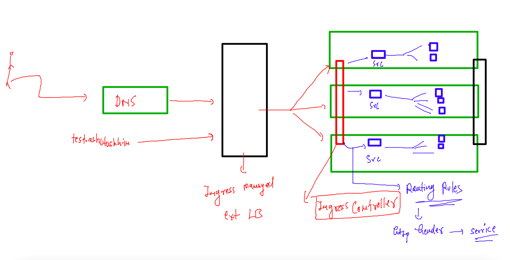
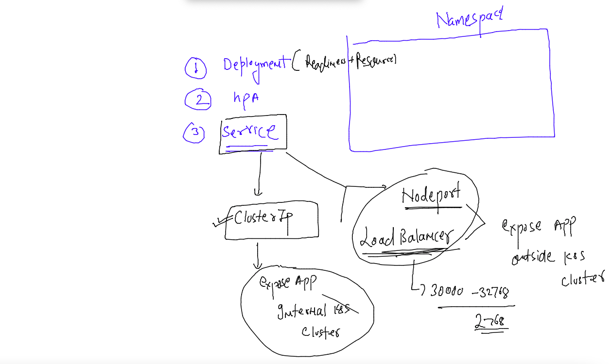

## Training plan 


### Revision 


### Ingress controller 



### clusterIP type service -- for internal exposing app 



### creating clusterIP type service 

```
kubectl create service clusterip  ashulb001 --tcp 1234:80 --dry-run=client -o yaml >clusterip.yaml 
```

### updated service yaml 

```
apiVersion: v1
kind: Service
metadata:
  creationTimestamp: null
  labels:
    app: ashulb001
  name: ashulb001
  namespace: ashu-project # adding namespace 
spec:
  ports:
  - name: 1234-80
    port: 1234
    protocol: TCP
    targetPort: 80
  selector: # updating label of pods 
    app: ashu-app
  type: ClusterIP # type of service 
status:
  loadBalancer: {}

```

### creating ingress object for routing rules 

```
[ashu@mobi-dockerserver ~]$ kubectl api-resources |   grep -i ingress
ingressclasses                                 networking.k8s.io/v1                   false        IngressClass
ingresses                         ing          networking.k8s.io/v1                   true         Ingress
[ashu@mobi-dockerserver ~]$ 


```

### lets deploy all yaml 

```
ashu@mobi-dockerserver app-deploy]$ kubectl apply -f  . 
service/ashulb001 created
deployment.apps/ashu-app created
horizontalpodautoscaler.autoscaling/ashu-app created
ingress.networking.k8s.io/ashu-ingress-rule created
[ashu@mobi-dockerserver app-deploy]$ 
[ashu@mobi-dockerserver app-deploy]$ kubectl  get  deploy
NAME       READY   UP-TO-DATE   AVAILABLE   AGE
ashu-app   1/1     1            1           14s
[ashu@mobi-dockerserver app-deploy]$ kubectl  get  po
NAME                       READY   STATUS    RESTARTS   AGE
ashu-app-6fb456798-tp66x   1/1     Running   0          5s
ashu-app-6fb456798-wdpl4   1/1     Running   0          20s
ashu-app-6fb456798-x7g8p   1/1     Running   0          5s
[ashu@mobi-dockerserver app-deploy]$ kubectl  get  svc
NAME        TYPE        CLUSTER-IP      EXTERNAL-IP   PORT(S)    AGE
ashulb001   ClusterIP   10.101.37.116   <none>        1234/TCP   24s
[ashu@mobi-dockerserver app-deploy]$ kubectl  get  hpa
NAME       REFERENCE             TARGETS         MINPODS   MAXPODS   REPLICAS   AGE
ashu-app   Deployment/ashu-app   <unknown>/70%   3         15        3          35s
[ashu@mobi-dockerserver app-deploy]$ kubectl  get  ingress
NAME                CLASS   HOSTS                 ADDRESS        PORTS   AGE
ashu-ingress-rule   nginx   jaipur.ashutoshh.in   172.31.83.42   80      40s
[ashu@mobi-dockerserver app-deploy]$ 
```


