## Training plan 


### app Deployment in Past using bare-metal 


### moving from Bare-metal To VM 

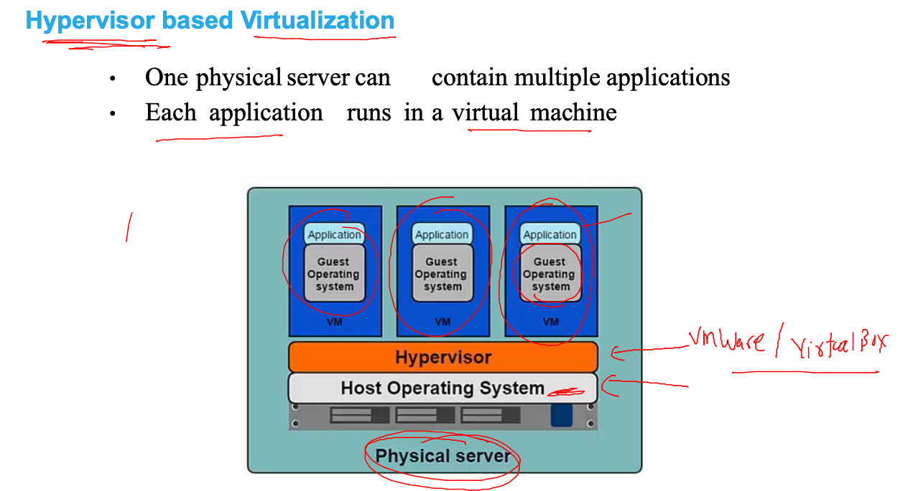

### more vm means more OS -- creating more resources 


### Introduction to containers 

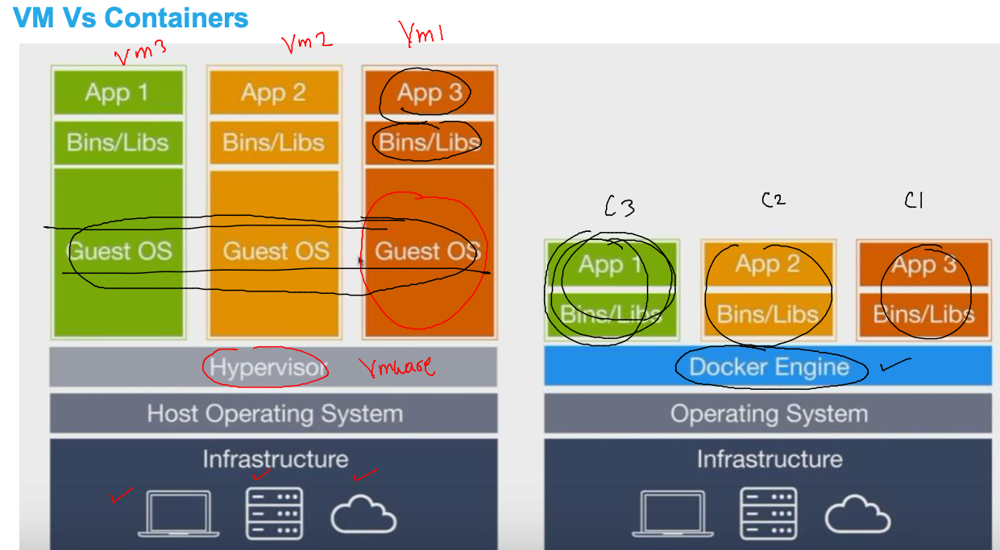

### Container journey 

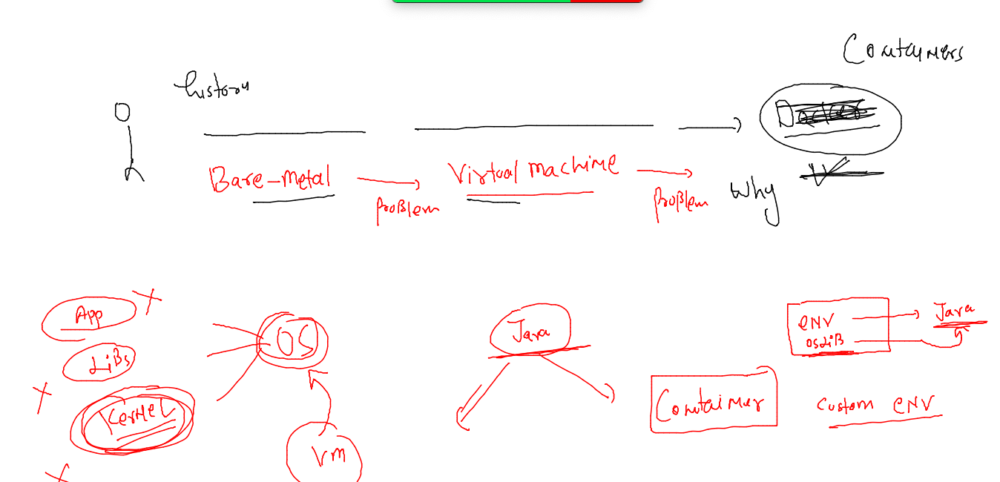

## Container ENgine 

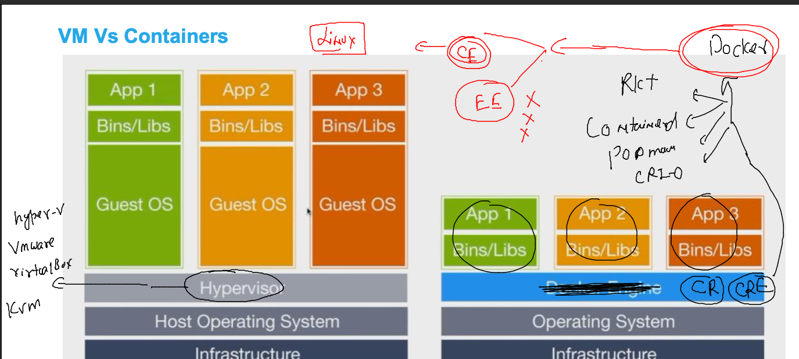

### Installing docker ce on LInux by amazon 

```
[root@mobi-dockerserver ~]# yum   install  docker  -y
Failed to set locale, defaulting to C
Loaded plugins: extras_suggestions, langpacks, priorities, update-motd
Resolving Dependencies
--> Running transaction check
---> Package docker.x86_64 0:20.10.17-1.amzn2 will be installed
--> Processing Dependency: runc >= 1.0.0 for package: docker-20.10.17-1.amzn2.x86_64
--> Processing Dependency: libcgroup >= 0.40.rc1-5.15 for package: docker-20.10.17-1.amzn2.x86_64
--> Processing Dependency: containerd >= 1.3.2 for package: docker-20.10.17-1.amzn2.x86_64
--> Processing Dependency: pigz for package: docker-20.10.17-1.amzn2.x86_64
--> Running transaction check
---> Package containerd.x86_64 0:1.6.6-1.amzn2 will be installe
```

### starting docker service 

```
[root@mobi-dockerserver ~]# systemctl start  docker 
[root@mobi-dockerserver ~]# systemctl enable  docker 
Created symlink from /etc/systemd/system/multi-user.target.wants/docker.service to /usr/lib/systemd/system/docker.service.
[root@mobi-dockerserver ~]# systemctl status  docker 
● docker.service - Docker Application Container Engine
   Loaded: loaded (/usr/lib/systemd/system/docker.service; enabled; vendor preset: disabled)
   Active: active (running) since Mon 2022-09-12 08:54:46 UTC; 15s ago
     Docs: https://docs.docker.com
 Main PID: 3635 (dockerd)

```

### Docs to install Docker ce 20 version 

[link](https://docs.docker.com/engine/install/)

### login with non root user 

```
[ashu@mobi-dockerserver ~]$ whoami
ashu
[ashu@mobi-dockerserver ~]$ docker  version 
Client:
 Version:           20.10.17
 API version:       1.41
 Go version:        go1.18.3
 Git commit:        100c701
 Built:             Thu Jun 16 20:08:47 2022
 OS/Arch:           linux/amd64
 Context:           default
 Experimental:      true

Server:
 Engine:
  Version:          20.10.17
  API version:      1.41 (minimum version 1.12)
  Go version:       go1.18.3
  Git commit:       a89b842
  Built:            Thu Jun 16 20:09:24 2022
  OS/Arch:          linux/amd64
  Experimental:     false
 containerd:
  Version:          1.6.6
  GitCommit:        10c12954828e7c7c9b6e0ea9b0c02b01407d3ae1
```

## basic docker system architecture understanding 

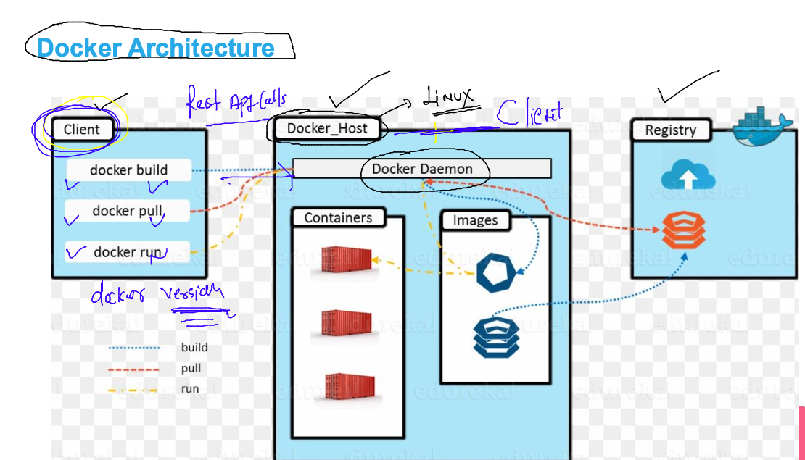

## application to run in a container 

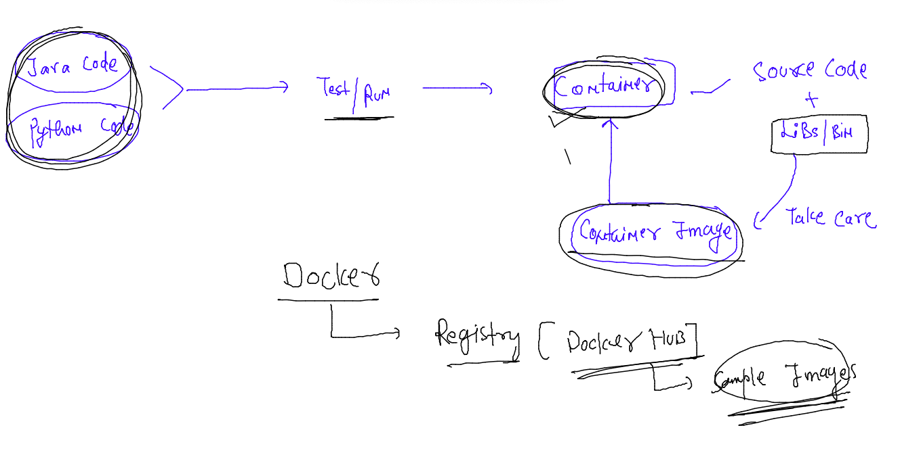

### Search image to docker hub 

```
[ashu@mobi-dockerserver ~]$ docker  search  nodejs
NAME                               DESCRIPTION                                     STARS     OFFICIAL   AUTOMATED
amazon/aws-lambda-nodejs           AWS Lambda base images for NodeJS               32                   
centos/nodejs-8-centos7            Platform for building and running Node.js 8 …   14                   
jelastic/nodejs                    An image of the NodeJS application server ma…   10                   
openshift/nodejs-010-centos7       DEPRECATED: A Centos7 based NodeJS v0.10 ima…   8                    
centos/nodejs-10-centos7           Platform for building and running Node.js 10…   8                    
nodejscn/node                      Docker Image for Node.js                        7                    [OK]
mc2labs/nodejs       
```
### pulling image from docker hub 

```
[ashu@mobi-dockerserver ~]$ docker  images
REPOSITORY   TAG       IMAGE ID   CREATED   SIZE
[ashu@mobi-dockerserver ~]$ docker  pull openjdk 
Using default tag: latest
latest: Pulling from library/openjdk
492d84e496ea: Pull complete 
f7d74542bd1a: Pull complete 
f066d8ddc02a: Pull complete 
Digest: sha256:5798afbe93d0d7519a8fa2cfd01d8073f6edb797d5a90e3681e80d62ce737328
Status: Downloaded newer image for openjdk:latest
docker.io/library/openjdk:latest
[ashu@mobi-dockerserver ~]$ 
[ashu@mobi-dockerserver ~]$ docker  pull  mysql 
Using default tag: latest
latest: Pulling from library/mysql
492d84e496ea: Already exists 
bbe20050901c: Pull complete 
e3a5e171c2f8: Pull complete 
c2cedd8aa061: Pull complete 
```

### pulling images 

```
   14  docker  pull  nginx:1.23
   15  history 
[ashu@mobi-dockerserver ~]$ docker  images
REPOSITORY   TAG       IMAGE ID       CREATED       SIZE
python       latest    4f9baf941f8e   4 days ago    921MB
openjdk      latest    2ca167855991   12 days ago   462MB
mysql        latest    ff3b5098b416   12 days ago   447MB
nginx        1.23      2b7d6430f78d   2 weeks ago   142MB
bash         latest    58c36729bafd   4 weeks ago   13MB
alpine       latest    9c6f07244728   4 weeks ago   5.54MB

```

### creating first container 

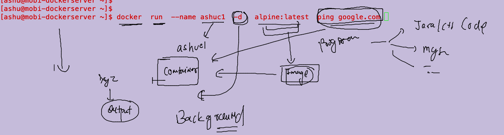

### creating container 

```
[ashu@mobi-dockerserver ~]$ docker  run  --name ashuc1  -d   alpine:latest  ping google.com 
1b3a15c047a5ebbfdc9c8254bdb857c10225110ccb859992cd27847c7efddaf2
[ashu@mobi-dockerserver ~]$ docker  ps
CONTAINER ID   IMAGE           COMMAND             CREATED              STATUS              PORTS     NAMES
1b3a15c047a5   alpine:latest   "ping google.com"   11 seconds ago       Up 10 seconds                 ashuc1
1b286a961408   alpine:latest   "ping google.com"   12 seconds ago       Up 10 seconds                 filipe_alpine_1
bc83b635c82d   alpine:latest   "ping google.com"   30 seconds ago       Up 28 seconds                 rajc1
b6aa093e05b3   alpine:latest   "ping google.com"   53 seconds ago       Up 52 seconds                 sofiac1
91b7207d7175   alpine          "ping 8.8.8.8"      About a minute ago   Up About a minute             ricardo-1
efad82cb3630   alpine:latest   "ping google.com"   2 minutes ago        Up 2 minutes                  arya1
[ashu@mobi-dockerserver ~]$ 


```


### running a child command /process in a running container 

```
[ashu@mobi-dockerserver ~]$ docker  exec  ashuc1  uname -r
5.10.130-118.517.amzn2.x86_64
```

### container is using heavily less resources 

```
[ashu@mobi-dockerserver ~]$ docker  stats  ashuc1  
CONTAINER ID   NAME      CPU %     MEM USAGE / LIMIT   MEM %     NET I/O           BLOCK I/O   PIDS
1b3a15c047a5   ashuc1    0.01%     352KiB / 7.76GiB    0.00%     66.6kB / 64.8kB   0B / 0B     1
^C

```

### life of container 

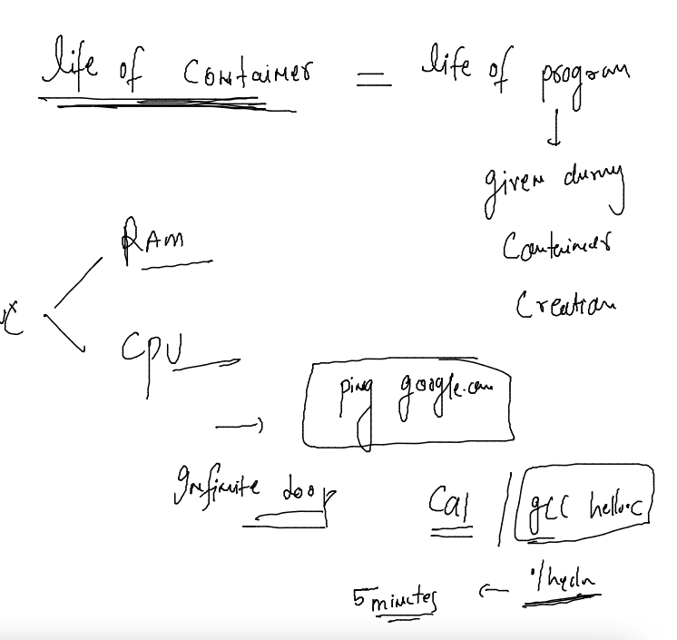

### checking output of container default program 

```
[ashu@mobi-dockerserver ~]$ docker  logs  ashuc1  
PING google.com (172.253.122.113): 56 data bytes
64 bytes from 172.253.122.113: seq=0 ttl=98 time=1.601 ms
64 bytes from 172.253.122.113: seq=1 ttl=98 time=1.655 ms
64 bytes from 172.253.122.113: seq=2 ttl=98 time=1.640 ms

```

### 

```
docker logs -f  ashuc1
```

### stopping your running container 

```
[ashu@mobi-dockerserver ~]$ docker  stop  ashuc1
ashuc1
```

### checking list of containers in every state

```
[ashu@mobi-dockerserver ~]$ docker  ps  -a 
CONTAINER ID   IMAGE           COMMAND                  CREATED          STATUS                            PORTS     NAMES
13e0420b0f82   alpine:latest   "/bin/sh"                6 minutes ago    Exited (0) 6 minutes ago                    sofiac5
8fecced191a1   alpine          "ping google.com"        15 minutes ago   Exited (137) About a minute ago             fernando
9b2da6236710   alpine:latest   "ping google.com"        16 minutes ago   Exited (137) 52 seconds ago                 vbrt
850d8cd85fd1   alpine:latest   "ping google.com"        16 minutes ago   Exited (137) 57 seconds ago                 aseemC1
ca3d21e8c97b   alpine          "ping google.com"        16 minutes ago   Exited (137) 2 seconds ago                  shailendra1
55e82df61f64   bash            "docker-entrypoint.s…"   16 minutes ago   Exited (137) 16 minutes ago                 ricardo-2
c1de348eb37e   bash            "docker-entrypoint.s…"   18 minutes ago   Exited (137) About a minute ago             som1
84e7067d4c94   python:latest   "ping google.com"        18 minutes ago   Created                                     nalina
9d11551faab6   alpine:latest   "ping google.com"        18 minutes ago   Up 18 minutes                               Ritesh
8d92774344c5   alpine:latest   "ping google.com"        18 minutes ago   Exited (137) About a minute ago             som
aee389f6c167   alpine:latest   "docker version"      
```

### starting a stopped container 

```
[ashu@mobi-dockerserver ~]$ docker  start  ashuc1
ashuc1
[ashu@mobi-dockerserver ~]$ docker  ps
CONTAINER ID   IMAGE           COMMAND             CREATED          STATUS                  PORTS     NAMES
63cb23b47b51   alpine:latest   "ping google.com"   22 minutes ago   Up Less than a second             vccardoso1
1b3a15c047a5   alpine:latest   "ping google.com"   22 minutes ago   Up 7 seconds                      ashuc1
bc83b635c82d   alpine:latest   "ping google.com"   23 minutes ago   Up 1 second     
```

### get the container shell 

```
[ashu@mobi-dockerserver ~]$ whoami
ashu
[ashu@mobi-dockerserver ~]$ docker  exec  -it  ashuc1  sh 
/ # 
/ # whoami
root
/ # uname -r
5.10.130-118.517.amzn2.x86_64
/ # 
/ # cat /etc/os-release 
NAME="Alpine Linux"
ID=alpine
VERSION_ID=3.16.2
PRETTY_NAME="Alpine Linux v3.16"
HOME_URL="https://alpinelinux.org/"
BUG_REPORT_URL="https://gitlab.alpinelinux.org/alpine/aports/-/issues"
/ # 
/ # exit
[ashu@mobi-dockerserver ~]$ 
[ashu@mobi-dockerserver ~]$ whoami
ashu
[ashu@mobi-dockerserver ~]$ 
```

### stop and delete container 

```
[ashu@mobi-dockerserver ~]$ docker stop  ashuc1  ; docker rm ashuc1 
ashuc1
ashuc1
```

## Container image management 

### Build custom image to integrate app/source code 

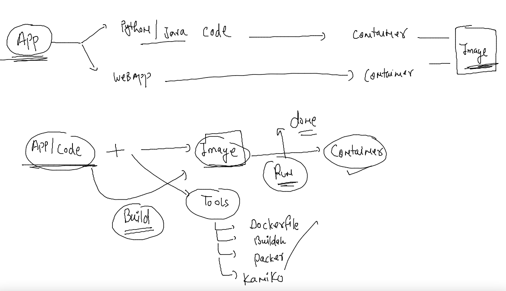


## Creating custom Docker images 

### Python code to docker image 

### python code 

```
import time

while True:
    print("Hello all , welcome to python..!!")
    time.sleep(3)
    print("Welcome to Mobileum..")
    time.sleep(2)
    print("Welcome to Containers ..!!")
    print("______________________")
    time.sleep(3)
```


### Dockerfile 

```
FROM python 
# docker host will be download python image from Docker hub 
LABEL name=ashutoshh
LABEL email=ashutoshh@linux.com
# Label is optional but you can use to write image Designer info 
RUN mkdir /mycode 
# RUN is for executing shell command during image creation time 
COPY  mobi.py  /mycode/
# copy code inside docker image 
CMD ["python","/mycode/mobi.py"]
# to set default process/program to this docker image 

```

### Understanding Dockerfile 


### lets build image 

```
[ashu@mobi-dockerserver myimages]$ cd  pythoncode/
[ashu@mobi-dockerserver pythoncode]$ ls
Dockerfile  mobi.py
[ashu@mobi-dockerserver pythoncode]$ docker build  -t   ashupython:v1  . 
Sending build context to Docker daemon  3.072kB
Step 1/6 : FROM python
 ---> 4f9baf941f8e
Step 2/6 : LABEL name=ashutoshh
 ---> Running in 3c7996316223
Removing intermediate container 3c7996316223
 ---> db6e42b18833
Step 3/6 : LABEL email=ashutos
```

### checking image 

```
[ashu@mobi-dockerserver pythoncode]$ docker images  |   grep -i ashu
ashupython        v1        53ee4bfb3343   3 minutes ago        921MB
[ashu@mobi-dockerserver pythoncode]$ 

```

### creating container from last image 

```
[ashu@mobi-dockerserver pythoncode]$ docker run -it -d  --name ashuc2 ashupython:v1  
73f80b892808ccfe72f6a15e0bcd52135c742ca581997f8d6a3b6b3a89b008c3
[ashu@mobi-dockerserver pythoncode]$ docker  ps
CONTAINER ID   IMAGE                COMMAND                  CREATED          STATUS                  PORTS     NAMES
068239824b78   sofiapython:1.1      "python /mycode/mobi…"   1 second ago     Up Less than a second             sofiac2
1170f2cea2db   fernandopython:1.1   "python /mycode/mobi…"   3 seconds ago    Up 2 seconds                      fernando2
bb8b8b34b907   nuno:1.1             "python /mycode/mobi…"   5 seconds ago    Up 3 seconds                      nuno1
97cbed1ce1d6   filipe-python:1.1    "python /mycode/mobi…"   6 seconds ago    Up 5 seconds                      filipe_2
73f80b892808   ashupython:v1        "python /mycode/mobi…"   8 seconds ago    Up 7 seconds                      ashuc2
f91ad4da9e0b   ricardo-python:1.0   "python /code/mobi.py"   32 seconds ago   Up 32 seconds                     ricardo-python-1
2388a3320cde   roy-python:0.0.1     "python /mycode/m.py"    45 seconds ago   Up 45 seconds                     roy
58a4ab8de05b   rajeshpython:1.1     "python /mycode/mobi…"   5 minutes ago    Up 5 minutes                      rajc1
[ashu@mobi-dockerserver pythoncode]$ 
```

### checking output of code 

```
[ashu@mobi-dockerserver pythoncode]$ docker  logs ashuc2 
Hello all , welcome to python..!!
Welcome to Mobileum..
Welcome to Containers ..!!
______________________
```

### creating new image with new changes 

```
[ashu@mobi-dockerserver myimages]$ ls
javacode  pythoncode
[ashu@mobi-dockerserver myimages]$ docker build  -t   ashupython:v2  pythoncode/
Sending build context to Docker daemon  4.096kB
Step 1/7 : FROM python
 ---> 4f9baf941f8e
Step 2/7 : LABEL name=ashutoshh
 ---> Using cache
 ---> db6e42b18833
Step 3/7 : LABEL email=ashutoshh@linux.com
 ---> Using cache

```


### final commands 

```
 125  docker run -itd --name ashuc2 ashupython:v2 
  126  docker run -itd --name ashuc3 ashupython:v2  python /mycode/hello.py
```

### New Dockerfile to Python code 

```
FROM oraclelinux:8.4 
# docker host will be download python image from Docker hub 
LABEL name=ashutoshh
LABEL email=ashutoshh@linux.com
# Label is optional but you can use to write image Designer info 
RUN  yum install python3 -y 
RUN mkdir /mycode 
# RUN is for executing shell command during image creation time 
COPY  mobi.py  /mycode/
# copy code inside docker image 
CMD ["python","/mycode/mobi.py"]
# to set default process/program to this docker image 

```

### lets buid it 

```
docker build -t ashupython:v3  -f small.dockerfile  . 
```

### checking image size 

```
[root@mobi-dockerserver ~]# docker  images  |  grep -i ashu
ashupython        v3        59b41d8eed51   10 seconds ago       442MB
ashupython        v2        31dd9bde8463   42 minutes ago       921MB
ashupython        v1        53ee4bfb3343   About an hour ago    921MB
[root@mobi-dockerserver ~]# 


```

### Image registry in Docker to store images 

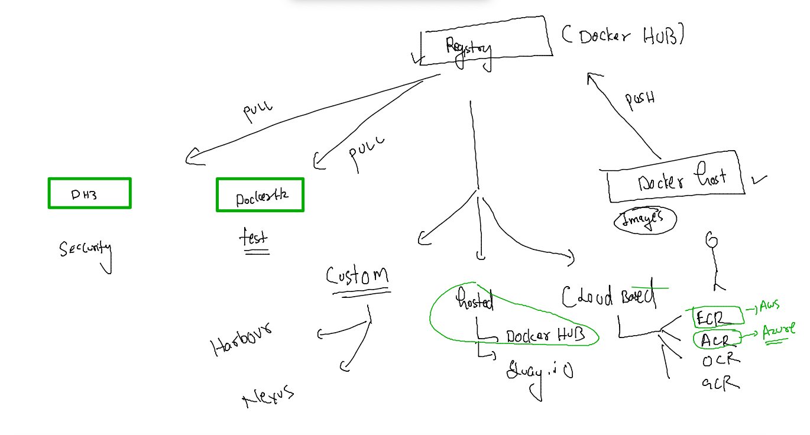


### image name format of docker hub 

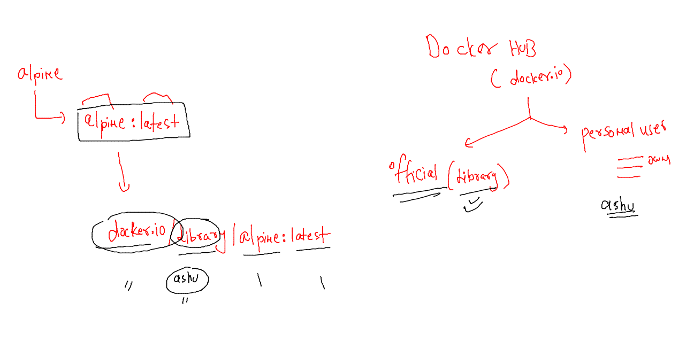

### demo 

```
[root@mobi-dockerserver ~]# docker pull mysql
Using default tag: latest
latest: Pulling from library/mysql
492d84e496ea: Already exists 
bbe20050901c: Pull complete 
e3a5e171c2f8: Pull complete 
c2cedd8aa061: Pull complete 
d6a485af4cc9: Pull complete 
ee16a57baf60: Pull complete 
64bab9180d2a: Pull complete 
c3aceb7e4f48: Pull complete 
269002e5cf58: Pull complete 
d5abeb1bd18e: Pull complete 
cbd79da5fab6: Pull complete 
Digest: sha256:cdf3b62d78d1bbb1d2bd6716895a84014e00716177cbb7e90f6c6a37a21dc796
Status: Downloaded newer image for mysql:latest
docker.io/library/mysql:latest
[root@mobi-dockerserver ~]# 


```


