## Training plan 


## Namespace 

### namespace for k8s resources Isolation 

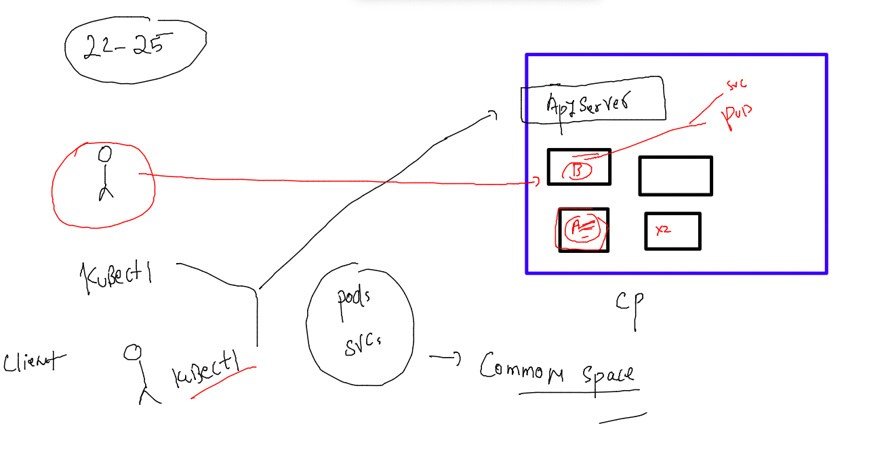

### checking default namespaces 

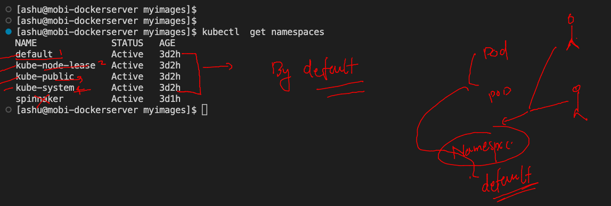

### creating and checking namespaces 

```
[ashu@mobi-dockerserver myimages]$ kubectl  get namespaces 
NAME              STATUS   AGE
default           Active   3d2h
kube-node-lease   Active   3d2h
kube-public       Active   3d2h
kube-system       Active   3d2h
spinnaker         Active   3d1h
```

### creating 

```
[ashu@mobi-dockerserver myimages]$ kubectl  create  namespace  ashu-project 
namespace/ashu-project created
[ashu@mobi-dockerserver myimages]$ kubectl   get  ns
NAME              STATUS   AGE
ashu-project      Active   4s
default           Active   3d2h
fjv               Active   17s
kube-node-lease   Active   3d2h
kube-public       Active   3d2h
kube-system       Active   3d2h
sofia-project     Active   2s
spinnaker         Active   3d1h
```


### setting default namespace to k8s client user 

```
[ashu@mobi-dockerserver myimages]$ kubectl  config set-context --current --namespace=ashu-project  
Context "kubernetes-admin@kubernetes" modified.
[ashu@mobi-dockerserver myimages]$ 
[ashu@mobi-dockerserver myimages]$ kubectl  get  pods
No resources found in ashu-project namespace.
[ashu@mobi-dockerserver myimages]$ 
[ashu@mobi-dockerserver myimages]$ 
[ashu@mobi-dockerserver myimages]$ 
[ashu@mobi-dockerserver myimages]$ 
[ashu@mobi-dockerserver myimages]$ kubectl  config get-contexts 
CURRENT   NAME                          CLUSTER      AUTHINFO           NAMESPACE
*         kubernetes-admin@kubernetes   kubernetes   kubernetes-admin   ashu-project
```

### all k8s control plane components are running in Kube-system namespaces 

```
[ashu@mobi-dockerserver myimages]$ kubectl  get  pods  -n kube-system 
NAME                                       READY   STATUS    RESTARTS        AGE
calico-kube-controllers-58dbc876ff-d2jj8   1/1     Running   3 (5h41m ago)   3d2h
calico-node-bqpv6                          1/1     Running   3 (5h41m ago)   3d2h
calico-node-ggglc                          1/1     Running   3 (5h41m ago)   3d2h
calico-node-xdtwj                          1/1     Running   3 (5h41m ago)   3d2h
calico-node-zp89l                          1/1     Running   3 (5h41m ago)   3d2h
coredns-565d847f94-jtnr5                   1/1     Running   3 (5h41m ago)   3d2h
coredns-565d847f94-jwjxl                   1/1     Running   3 (5h41m ago)   3d2h
etcd-control-plane                         1/1     Running   3 (5h41m ago)   3d2h
kube-apiserver-control-plane               1/1     Running   3 (5h41m ago)   3d2h
kube-controller-manager-control-plane      1/1     Running   3 (5h41m ago)   3d2h
kube-proxy-8fptn                           1/1     Running   3 (5h41m ago)   3d2h
kube-proxy-l5pkn                           1/1     Running   3 (5h41m ago)   3d2h
kube-proxy-skdn2                           1/1     Running   3 (5h41m ago)   3d2h
kube-proxy-vpscw                           1/1     Running   3 (5h41m ago)   3d2h
kube-scheduler-control-plane               1/1     Running   3 (5h41m ago)   3d2h
metrics-server-767967fcd-jq7pr             1/1     Running   3 (5h41m ago)   3d2h
[ashu@mobi-dockerserver myimages]$ 
```

### Namespace and Networking 

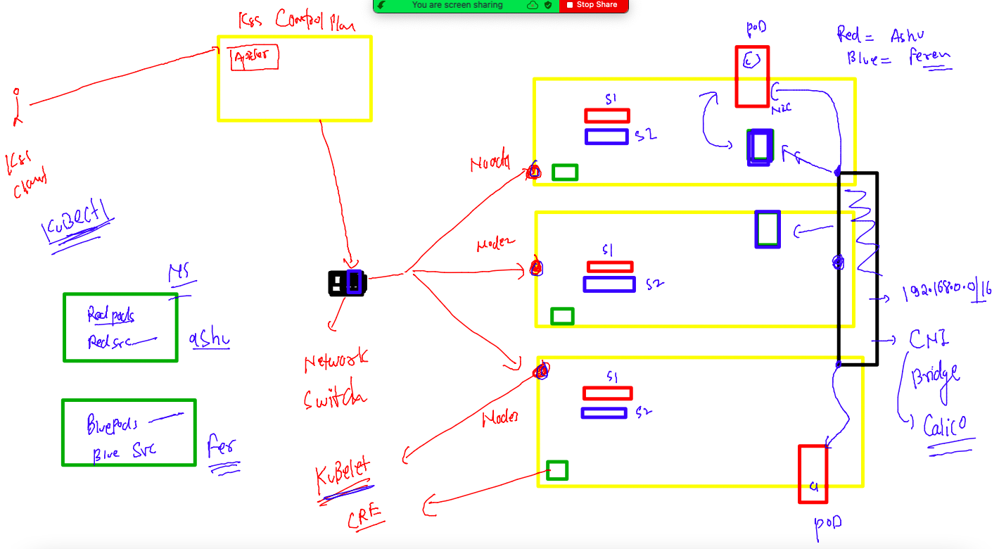

### k8s networking resources 

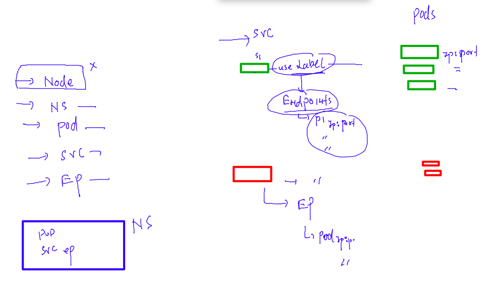

## Demo -- POd -- SVc 

### creating pod yaml 

```
[ashu@mobi-dockerserver myimages]$ cd k8s-resources/
[ashu@mobi-dockerserver k8s-resources]$ ls
ashupod1.yaml  autopod.yaml  logs.txt  nodeport.yaml  q1.yaml
[ashu@mobi-dockerserver k8s-resources]$ kubectl   run ashuwebapp --image=docker.io/dockerashu/ashuapp:mobiv11  --port 80 --dry-run=client -o yaml  >webpod.yaml 
[ashu@mobi-dockerserver k8s-resources]$ 

```

### modify YAML 

```
apiVersion: v1
kind: Pod
metadata:
  namespace: ashu-project # namespace info 
  creationTimestamp: null
  labels: # label of pod 
    x: helloashu # creating new label 
  name: ashuwebapp # name of pod 
spec:
  containers:
  - image: docker.io/dockerashu/ashuapp:mobiv11 # image from docker hub 
    name: ashuwebapp # name of container 
    ports: # container app port 
    - containerPort: 80
    resources: {}
  dnsPolicy: ClusterFirst
  restartPolicy: Always
status: {}

```

### deploy POD 

```
[ashu@mobi-dockerserver k8s-resources]$ ls
ashupod1.yaml  autopod.yaml  logs.txt  nodeport.yaml  q1.yaml  webpod.yaml
[ashu@mobi-dockerserver k8s-resources]$ kubectl  apply -f  webpod.yaml 
pod/ashuwebapp created
[ashu@mobi-dockerserver k8s-resources]$ kubectl  get  pods
NAME         READY   STATUS    RESTARTS   AGE
ashuwebapp   1/1     Running   0          4s
[ashu@mobi-dockerserver k8s-resources]$ kubectl  get  pods -o wide
NAME         READY   STATUS    RESTARTS   AGE   IP               NODE    NOMINATED NODE   READINESS GATES
ashuwebapp   1/1     Running   0          10s   192.168.135.49   node3   <none>           <none>
[ashu@mobi-dockerserver k8s-resources]$ 


```

### creating Nodeport service 

```
kubectl   create  service  nodeport ashuwebsvc --tcp 1234:80 --dry-run=client -o yaml     >websvc.yaml 
```

### deploy svc 

```
[ashu@mobi-dockerserver k8s-resources]$ kubectl   create  service  nodeport ashuwebsvc --tcp 1234:80 --dry-run=client -o yaml     >websvc.yaml 
[ashu@mobi-dockerserver k8s-resources]$ kubectl  apply -f websvc.yaml 
service/ashuwebsvc created
[ashu@mobi-dockerserver k8s-resources]$ kubectl  get  svc
NAME         TYPE       CLUSTER-IP     EXTERNAL-IP   PORT(S)          AGE
ashuwebsvc   NodePort   10.107.95.29   <none>        1234:32300/TCP   28s
[ashu@mobi-dockerserver k8s-resources]$ 
[ashu@mobi-dockerserver k8s-resources]$ kubectl  get  ep 
NAME         ENDPOINTS   AGE
ashuwebsvc   <none>      33s
[ashu@mobi-dockerserver k8s-resources]$ 


```

### service YAML modification 

```
apiVersion: v1
kind: Service
metadata:
  namespace: ashu-project 
  creationTimestamp: null
  labels:
    app: ashuwebsvc
  name: ashuwebsvc
spec:
  ports:
  - name: 1234-80
    port: 1234
    protocol: TCP
    targetPort: 80
  selector: # pod finder using pod label 
    x: helloashu # label of pod 
  type: NodePort
status:
  loadBalancer: {}

```

### redeploy 

```
[ashu@mobi-dockerserver k8s-resources]$ kubectl  apply -f websvc.yaml 
service/ashuwebsvc configured
[ashu@mobi-dockerserver k8s-resources]$ kubectl  get svc -o wide
NAME         TYPE       CLUSTER-IP       EXTERNAL-IP   PORT(S)          AGE    SELECTOR
ashuwebsvc   NodePort   10.107.108.104   <none>        1234:31604/TCP   115s   x=helloashu
[ashu@mobi-dockerserver k8s-resources]$ 
[ashu@mobi-dockerserver k8s-resources]$ kubectl  get  ep 
NAME         ENDPOINTS           AGE
ashuwebsvc   192.168.135.49:80   2m3s
[ashu@mobi-dockerserver k8s-resources]$ kubectl  get po -o wide
NAME         READY   STATUS    RESTARTS   AGE   IP               NODE    NOMINATED NODE   READINESS GATES
ashuwebapp   1/1     Running   0          17m   192.168.135.49   node3   <none>           <none>
```

## problems with Pod 

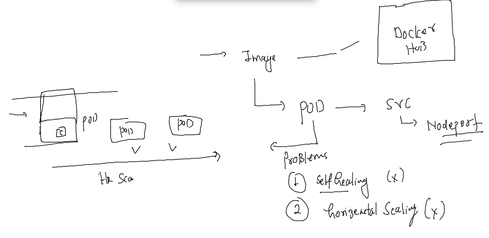

### Introduction to controllers

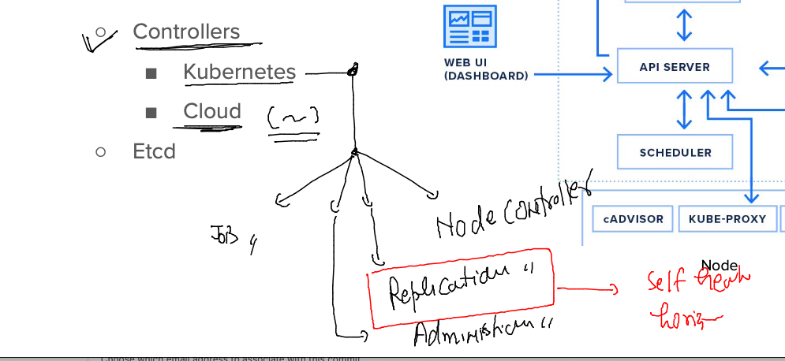

## COntrollers in kubernets -- Deployment 

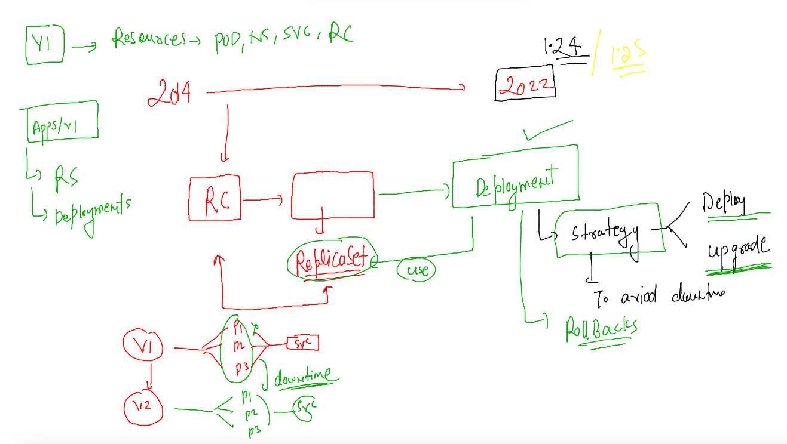

### Building app image 

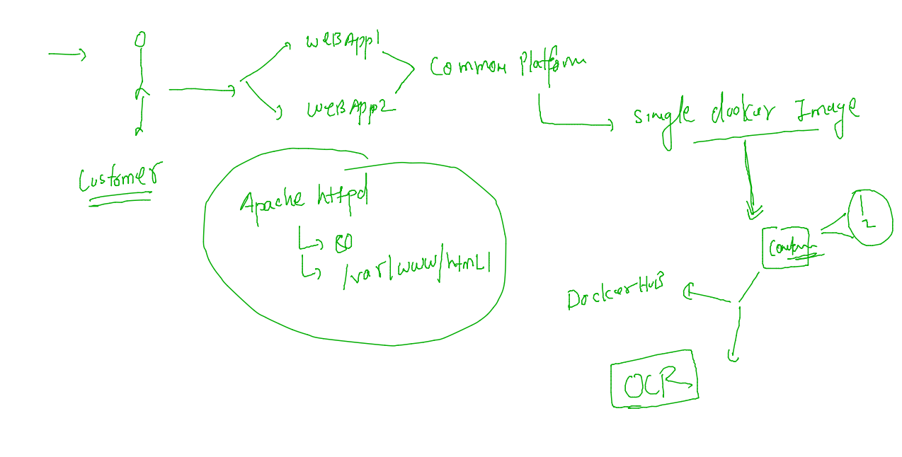

### cleaning namespace resources 

```
[ashu@mobi-dockerserver k8s-resources]$ kubectl  delete pod,svc --all
pod "ashuwebapp" deleted
service "ashuwebsvc" deleted
```

### creating deployment 

```
kubectl  create deployment ashu-deploy --image=docker.io/dockerashu/mobicustomer:v1  --port 80 --dry-run=client -o yaml  >deployment.yaml 
```
### YAML of Deployment 

```
apiVersion: apps/v1
kind: Deployment
metadata:
  creationTimestamp: null
  labels:
    app: ashu-deploy
  name: ashu-deploy
spec:
  replicas: 1 # number of pods we want to deploy 
  selector:
    matchLabels:
      app: ashu-deploy
  strategy: {} # deployment strategy 
  template: # this will be used to create pods 
    metadata:
      creationTimestamp: null
      labels:
        app: ashu-deploy
    spec:
      containers:
      - image: docker.io/dockerashu/mobicustomer:v1
        name: mobicustomer
        ports:
        - containerPort: 80
        resources: {}
status: {}

```

### Deploy above yaml 

```
[ashu@mobi-dockerserver k8s-resources]$ kubectl  apply -f  deployment.yaml 
deployment.apps/ashu-deploy created
[ashu@mobi-dockerserver k8s-resources]$ kubectl   get  deployment 
NAME          READY   UP-TO-DATE   AVAILABLE   AGE
ashu-deploy   1/1     1            1           24s
[ashu@mobi-dockerserver k8s-resources]$ kubectl  get  rs 
NAME                     DESIRED   CURRENT   READY   AGE
ashu-deploy-755fd7f67f   1         1         1       42s
[ashu@mobi-dockerserver k8s-resources]$ kubectl  get  po
NAME                           READY   STATUS    RESTARTS   AGE
ashu-deploy-755fd7f67f-46xsx   1/1     Running   0          52s
[ashu@mobi-dockerserver k8s-resources]$ 

```
### adding service yaml in same file 

```
apiVersion: apps/v1
kind: Deployment
metadata:
  creationTimestamp: null
  labels:
    app: ashu-deploy
  name: ashu-deploy
spec:
  replicas: 1 # number of pods we want to deploy 
  selector:
    matchLabels:
      app: ashu-deploy
  strategy: {} # deployment strategy 
  template: # this will be used to create pods 
    metadata:
      creationTimestamp: null
      labels: # label of pods 
        app: ashu-deploy
    spec:
      containers:
      - image: docker.io/dockerashu/mobicustomer:v1
        name: mobicustomer
        ports:
        - containerPort: 80
        resources: {}
status: {}

---

apiVersion: v1
kind: Service
metadata:
  creationTimestamp: null
  labels:
    app: ss11
  name: ss11
spec:
  ports:
  - name: 1234-80
    port: 1234
    protocol: TCP
    targetPort: 80
  selector: # pod finder  using label of pods 
    app: ashu-deploy # label of pod 
  type: NodePort
status:
  loadBalancer: {}

```
### redeploy 

```
[ashu@mobi-dockerserver k8s-resources]$ kubectl  apply -f  deployment.yaml 
deployment.apps/ashu-deploy configured
service/ss11 created
[ashu@mobi-dockerserver k8s-resources]$ kubectl  get  deploy 
NAME          READY   UP-TO-DATE   AVAILABLE   AGE
ashu-deploy   1/1     1            1           8m17s
[ashu@mobi-dockerserver k8s-resources]$ kubectl  get  svc
NAME   TYPE       CLUSTER-IP     EXTERNAL-IP   PORT(S)          AGE
ss11   NodePort   10.111.84.33   <none>        1234:31534/TCP   59s
[ashu@mobi-dockerserver k8s-resources]$ 

```

### YAML final with ENV 

```
apiVersion: apps/v1
kind: Deployment
metadata:
  creationTimestamp: null
  labels:
    app: ashu-deploy
  name: ashu-deploy
spec:
  replicas: 1 # number of pods we want to deploy 
  selector:
    matchLabels:
      app: ashu-deploy
  strategy: {} # deployment strategy 
  template: # this will be used to create pods 
    metadata:
      creationTimestamp: null
      labels: # label of pods 
        app: ashu-deploy
    spec:
      containers:
      - image: docker.io/dockerashu/mobicustomer:v1
        name: mobicustomer
        ports:
        - containerPort: 80
        env: # to call Env section of docker image 
        - name: deploy # name of Env from Dockerfile 
          value: webapp2 # value of env 
        resources: {}
status: {}

---

apiVersion: v1
kind: Service
metadata:
  creationTimestamp: null
  labels:
    app: ss11
  name: ss11
spec:
  ports:
  - name: 1234-80
    port: 1234
    protocol: TCP
    targetPort: 80
  selector: # pod finder  using label of pods 
    app: ashu-deploy # label of pod 
  type: NodePort
status:
  loadBalancer: {}

```

### Redeploy 

```
[ashu@mobi-dockerserver k8s-resources]$ kubectl  apply -f  deployment.yaml 
deployment.apps/ashu-deploy configured
service/ss11 configured
[ashu@mobi-dockerserver k8s-resources]$ kubectl  get  deploy 
NAME          READY   UP-TO-DATE   AVAILABLE   AGE
ashu-deploy   1/1     1            1           12m
[ashu@mobi-dockerserver k8s-resources]$ kubectl  get  svc
NAME   TYPE       CLUSTER-IP     EXTERNAL-IP   PORT(S)          AGE
ss11   NodePort   10.111.84.33   <none>        1234:31534/TCP   4m56s
```

### task 6 

```
apiVersion: apps/v1
kind: Deployment
metadata:
  creationTimestamp: null
  labels:
    app: mydep1
  name: mydep1
spec:
  replicas: 1
  selector:
    matchLabels:
      app: mydep1
  strategy: {}
  template:
    metadata:
      creationTimestamp: null
      labels:
        app: mydep1
    spec:
      containers:
      - image: mysql:5.6
        name: mysql
        env: 
        - name: MYSQL_ROOT_PASSWORD
          value: "Db@098#"
        resources: {}
status: {}
---
apiVersion: v1
kind: Service
metadata:
  creationTimestamp: null
  labels:
    app: ss11
  name: ss11
spec:
  ports:
  - name: 1234-3306
    port: 1234
    protocol: TCP
    targetPort: 3306
  selector:
    app: mydep1
  type: ClusterIP
status:
  loadBalancer: {}
```

## scaling in POd

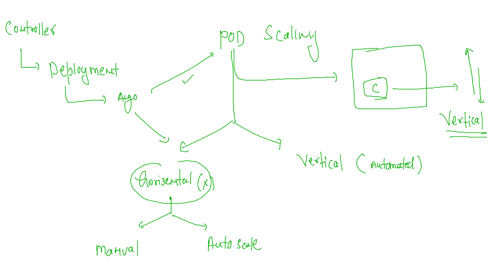

### manual horizental scaling 

```
[ashu@mobi-dockerserver k8s-resources]$ kubectl  scale  deployment  ashu-deploy  --replicas 3
deployment.apps/ashu-deploy scaled
[ashu@mobi-dockerserver k8s-resources]$ kubectl  get deploy 
NAME          READY   UP-TO-DATE   AVAILABLE   AGE
ashu-deploy   3/3     3            3           12m
[ashu@mobi-dockerserver k8s-resources]$ kubectl  get po
NAME                           READY   STATUS    RESTARTS   AGE
ashu-deploy-5587b4f77c-5pdfn   1/1     Running   0          16s
ashu-deploy-5587b4f77c-gx5pf   1/1     Running   0          6m58s
ashu-deploy-5587b4f77c-hddqh   1/1     Running   0          16s
[ashu@mobi-dockerserver k8s-resources]$ kubectl  get po -o wide
NAME                           READY   STATUS    RESTARTS   AGE    IP                NODE    NOMINATED NODE   READINESS GATES
ashu-deploy-5587b4f77c-5pdfn   1/1     Running   0          22s    192.168.104.45    node2   <none>           <none>
ashu-deploy-5587b4f77c-gx5pf   1/1     Running   0          7m4s   192.168.135.33    node3   <none>           <none>
ashu-deploy-5587b4f77c-hddqh   1/1     Running   0          22s    192.168.166.160   node1   <none>           <none>
[ashu@mobi-dockerserver k8s-resources]$ kubectl   get  ep 
NAME   ENDPOINTS                                                AGE
ss11   192.168.104.45:80,192.168.135.33:80,192.168.166.160:80   12m
```

## How end user access application -- network flow 

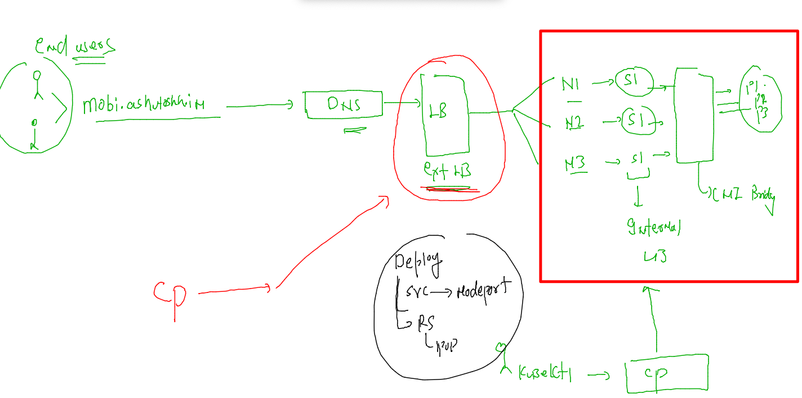

###  K8s setup method understanding 

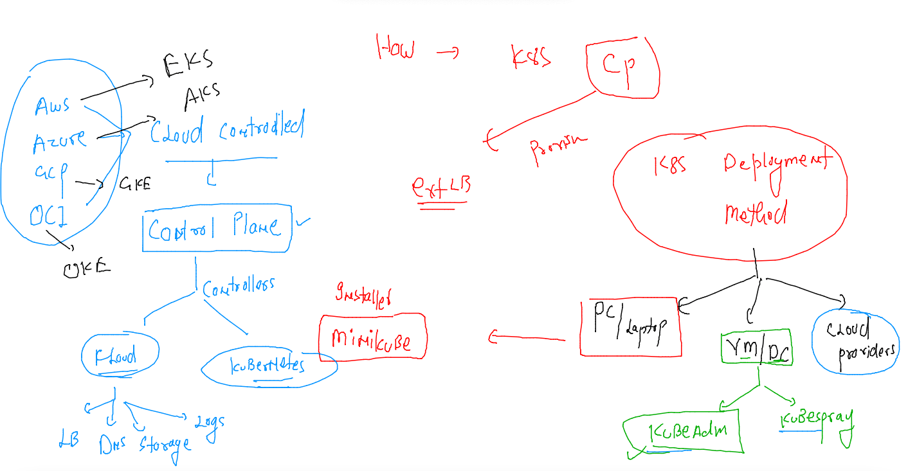

### expose command to create service  

```
 667  kubectl  get  deploy 
  668  kubectl  expose  deployment  ashu-deploy  --type LoadBalancer   --port 80  --name ashulb1 
  669  kubectl  get  svc
  670  kubectl  get  ep
  671  kubectl  expose  deployment  ashu-deploy  --type NodePort    --port 80  --name ashulb2 
  672  kubectl  get  svc

```

## HPA understanding 

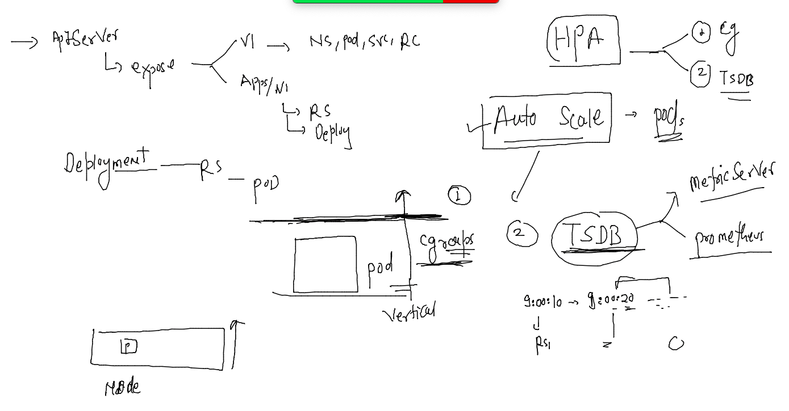

### Hpa Implement 

#### creating deployment 

```
kubectl   create  deploy  ashud1 --image=dockerashu/mobicustomer:v2  --port 80  --dry-run=client -o yaml >newdeploy.yaml 
```

### modified deployment YAML 

```
apiVersion: apps/v1
kind: Deployment
metadata:
  creationTimestamp: null
  labels:
    app: ashud1
  name: ashud1
spec:
  replicas: 1 # number of pod 
  selector:
    matchLabels:
      app: ashud1
  strategy: {}
  template: # to create pods 
    metadata:
      creationTimestamp: null
      labels:
        app: ashud1
    spec:
      containers:
      - image: dockerashu/mobicustomer:v2
        name: mobicustomer
        ports:
        - containerPort: 80
        env:  # adding Env section 
        - name: deploy
          value: webapp1 
        resources: # adding cgroups 
          requests: # default request 
            cpu: 100m # 1vcpu = 1000m -- milicore 
            memory: 300M 
          limits: # max usage 
            cpu: 200m 
            memory: 500M 
status: {}

```

### Deploy it 

```
[ashu@mobi-dockerserver k8s-resources]$ kubectl apply -f newdeploy.yaml 
deployment.apps/ashud1 created
[ashu@mobi-dockerserver k8s-resources]$ kubectl  get  deploy 
NAME     READY   UP-TO-DATE   AVAILABLE   AGE
ashud1   1/1     1            1           7s
[ashu@mobi-dockerserver k8s-resources]$ kubectl  get  po
NAME                     READY   STATUS    RESTARTS   AGE
ashud1-864787c87-vjqfx   1/1     Running   0          12s

```

### creating service 

```
[ashu@mobi-dockerserver k8s-resources]$ kubectl  get deploy 
NAME     READY   UP-TO-DATE   AVAILABLE   AGE
ashud1   1/1     1            1           14s
[ashu@mobi-dockerserver k8s-resources]$ kubectl  expose deploy  ashud1 --type NodePort --port 80   --name ashulb1 --dry-run=client -o yaml  >newsvc.yaml 
[ashu@mobi-dockerserver k8s-resources]$ kubectl  apply -f newsvc.yaml 
service/ashulb1 created
[ashu@mobi-dockerserver k8s-resources]$ kubectl  get svc
NAME      TYPE       CLUSTER-IP     EXTERNAL-IP   PORT(S)        AGE
ashulb1   NodePort   10.98.43.164   <none>        80:30004/TCP   4s
[ashu@mobi-dockerserver k8s-resources]$ kubectl get  ep 
NAME      ENDPOINTS            AGE
ashulb1   192.168.166.158:80   7s
[ashu@mobi-dockerserver k8s-resources]$ 

```

### Hpa 

```
[ashu@mobi-dockerserver k8s-resources]$ kubectl  get deploy 
NAME     READY   UP-TO-DATE   AVAILABLE   AGE
ashud1   1/1     1            1           4m1s
[ashu@mobi-dockerserver k8s-resources]$ kubectl autoscale deployment  ashud1 --cpu-percent 80     --min 3  --max 20 --dry-run=client -o yaml >hpa.yaml 
[ashu@mobi-dockerserver k8s-resources]$ kubectl get deploy 
NAME     READY   UP-TO-DATE   AVAILABLE   AGE
ashud1   1/1     1            1           6m43s
[ashu@mobi-dockerserver k8s-resources]$ kubectl  apply -f hpa.yaml 
horizontalpodautoscaler.autoscaling/ashud1 created
[ashu@mobi-dockerserver k8s-resources]$ kubectl get deploy 
NAME     READY   UP-TO-DATE   AVAILABLE   AGE
ashud1   1/1     1            1           6m54s
[ashu@mobi-dockerserver k8s-resources]$ kubectl get deploy 
NAME     READY   UP-TO-DATE   AVAILABLE   AGE
ashud1   3/3     3            3           7m15s
[ashu@mobi-dockerserver k8s-resources]$ 
```


